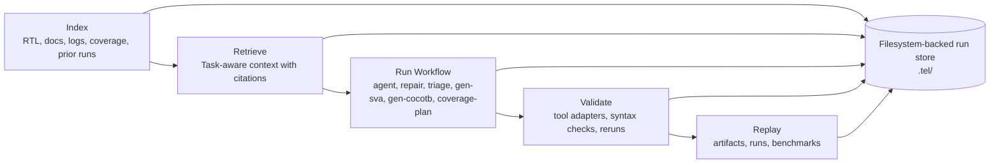
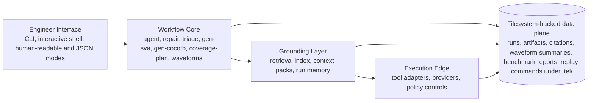

# Telchines

<p align="center">
  
</p>

<p align="center">
  <em>CLI-first verification workflows for hardware teams that want grounded, replayable AI instead of generic repo chat.</em>
</p>

<p align="center">
  <a href="https://github.com/ivanbard/telchines/actions/workflows/ci.yml"></a>
  
  
  
  
</p>

<p align="center">
  <a href="#quick-start"><strong>Quick Start</strong></a> |
  <a href="#what-you-can-do-with-v1"><strong>v1 Workflows</strong></a> |
  <a href="#how-it-works"><strong>How It Works</strong></a> |
  <a href="#documentation"><strong>Documentation</strong></a>
</p>

## Why Telchines

Generic coding assistants are weak at verification work because the real loop is not just text generation. It is specs, RTL, logs, tool feedback, coverage holes, prior runs, and the ability to replay what happened.

Telchines is built around that loop:

- retrieve evidence from RTL, docs, logs, and run history
- run verification-native workflows instead of generic chat prompts
- preserve replay artifacts and citations
- validate outputs through adapters and deterministic gates
- keep model routing local-first and policy-aware

> Telchines is not trying to replace simulators or formal tools. It is the orchestration layer that helps engineers move from signal to next action faster.

## What You Can Do With v1

| Workflow | What it does | Primary command |
| --- | --- | --- |
| Retrieval | Builds task-aware evidence packs from repo and run history | `tel retrieve "query"` |
| Agent | Plans and runs review-gated hardware tasks with evidence replay | `tel agent "fix..." --tool ... --file ...` |
| Repair | Proposes and validates minimal fixes from tool output | `tel repair --tool ... --file ...` |
| Triage | Clusters repeated regressions with evidence and history | `tel triage --logs logs/regressions` |
| Spec-to-SVA | Generates first-pass assertions from spec plus RTL | `tel gen-sva --spec docs/uart.md --rtl rtl/uart_rx.sv` |
| DUT-to-Cocotb | Scaffolds a grounded cocotb starter testbench | `tel gen-cocotb --dut rtl/uart_rx.sv --spec docs/uart.md` |
| Coverage Planning | Classifies uncovered items and ranks next actions | `tel coverage-plan --report cov/coverage.json ...` |
| Waveform Debug | Parses VCDs and inspects signals from CLI or shell | `tel waveforms show ...` |
| Benchmarks | Runs the built-in offline evaluation suite | `tel eval run` |

## What It Looks Like

```text
$ tel

tel[uart] sample_project> /index
Index Complete
indexed 18 chunks

tel[uart] sample_project> /triage --logs logs/regressions
Triage Summary
run run_... produced 2 cluster(s)

1. UART receiver start-bit regressions grouped together
likely cause: missing stimulus or broken start-bit detection path
suggested action: inspect uart_rx start-bit handling and nearby waveform evidence
evidence: docs/uart.md#L1, rtl/uart_rx.sv#L1, logs/regressions/run_a.log#L1

tel[uart] sample_project> /gen-sva --spec docs/uart.md --rtl rtl/uart_rx.sv
Spec-to-SVA Result
provider: heuristic
status: validated
artifact: .tel/artifacts/generated/uart_rx_assertions.sv
validation: passed
```

## How It Works



Telchines keeps the loop explicit:

1. Index the project and build retrieval context.
2. Run a verification workflow such as the review-gated agent path, repair, triage, generation, or coverage planning.
3. Store evidence, artifacts, validation output, and replay metadata under `.tel/`.
4. Reuse prior runs and benchmark the behavior over time.

## Architecture Snapshot



## Quick Start

Install the current release from PyPI:

```bash
pip install telchines
```

For local development from a checkout:

```bash
python -m venv .venv
# Windows PowerShell
.venv\Scripts\Activate.ps1
# Linux, WSL, and macOS
. .venv/bin/activate
pip install -e .[dev]
```

Validate the install:

```bash
tel --version
telchines --help
```

On the first `tel` launch outside a project, Telchines opens a one-time setup wizard for provider defaults and privacy choices. It asks about local-command providers, acknowledgement that `.tel/` can retain task artifacts, and optional private shell-history storage. It never initializes a repository. After setup, move to a repository and run:

```bash
tel project init .
```

Start verification work with a cited, review-gated task plan:

```bash
tel task "investigate the failing UART regression" --logs logs/regressions/run_a.log
```

The plan identifies the selected workflow, evidence, provider/model, required inputs, expected artifacts, and validation limits. Add `--execute-safe` only after reviewing it; Telchines never applies a repair patch through `tel task`.

Run `tel setup` or `/setup` later to update the global defaults used by newly initialized projects. Provider credentials are referenced by environment-variable name and are never saved in Telchines configuration.

For a guided, read-only assessment of the current directory and its next best workflow:

```bash
tel get-started
```

When you are ready to create the project state and build the first index, confirm the guided flow:

```bash
tel get-started --init
```

Experienced users can initialize and index a project directly:

```bash
tel project init .
tel index
tel index status
tel providers list
tel providers check heuristic
```

Run a few common workflows:

```bash
tel retrieve "uart timeout handling"
tel agent "fix the broken counter compile failure" --tool verilator --file rtl/broken_counter.sv
tel triage --logs logs/regressions --format human
tel gen-sva --spec docs/uart.md --rtl rtl/uart_rx.sv
tel gen-cocotb --dut rtl/uart_rx.sv --spec docs/uart.md --intent "smoke the start-bit path"
tel coverage-plan --report cov/coverage.json --rtl rtl/uart_rx.sv --spec docs/uart.md --format human
```

For frequent tasks, concise recipes use human-readable output by default:

```bash
tel diagnose-regressions logs/regressions
tel fix-compile rtl/broken_counter.sv --tool verilator
tel draft-assertions --spec docs/uart.md --rtl rtl/uart_rx.sv
tel scaffold-cocotb --dut rtl/uart_rx.sv --spec docs/uart.md
```

## Interactive Shell

Running `tel` with no arguments opens the shell. Use `tel shell --plain` for the stdin/stdout shell or `tel shell --fullscreen` to request the prompt_toolkit full-screen shell explicitly. Slash commands and lightweight plain-text intents are both supported.

```text
tel> /help
tel> /providers
tel> /providers check heuristic
tel> /index
tel> /index status
tel> /agent "fix the broken counter compile failure" --tool verilator --file rtl/broken_counter.sv
tel> /triage --logs logs/regressions
tel> /gen-sva --spec docs/uart.md --rtl rtl/uart_rx.sv
tel> show my providers
tel> triage the regression logs
tel> /exit
```

## Adapter And Provider Model

Built-in adapters in `v1`:

- `verilator`
- `iverilog`
- `slang`
- `verible`
- `symbiyosys`

Provider kinds in `v1`:

- `heuristic`
- `openai_compatible`
- `anthropic`
- `local_command`
- `agent_runtime` (optional repair-loop pilot; install `telchines[agentic]` for LangGraph dependencies)

Policy controls:

- `model_mode=local` blocks external HTTP providers, while allowing built-in, local command, and loopback local HTTP providers
- `model_mode=remote` blocks local command providers
- `model_mode=hybrid` allows both
- `no_egress=true` blocks external HTTP providers

Artifact lifecycle controls:

- `tel doctor privacy` reports provider egress, local command, and artifact-retention risks
- `tel artifacts purge` previews artifact cleanup by default
- `tel artifacts purge --scope task-artifacts --older-than-days 30 --yes` deletes only matching old artifact payloads while preserving run metadata

Shell history is disabled by default. When enabled with `tel history enable`, it is stored beside user-level Telchines settings rather than in a project repository; use `tel history status` and `tel history clear` to manage it.

See [docs/adapters.md](https://github.com/ivanbard/telchines/blob/main/docs/adapters.md), [docs/providers.md](https://github.com/ivanbard/telchines/blob/main/docs/providers.md), and [docs/generated-artifacts.md](https://github.com/ivanbard/telchines/blob/main/docs/generated-artifacts.md) for the exact support contract.

## Benchmarks And Release Validation

Telchines ships with an offline benchmark suite covering:

- repair
- review-gated agent loop
- triage
- retrieval
- spec-to-SVA
- DUT-to-cocotb
- coverage planning

Run it with:

```bash
tel eval run
tel eval report
```

When run inside an initialized Telchines project, `tel eval run` persists the latest report under `.tel/reports`. When run outside a project, it uses a temporary scratch project and prints a non-persisted report with `project_context: "scratch"`; inspect the report's `total` field for the current default suite size.

## v1 Scope

Included:

- interactive shell and one-shot CLI
- project indexing and retrieval
- run storage and replay
- review-gated `agent`, repair, triage, waveform inspection, `gen-sva`, `gen-cocotb`, and `coverage-plan`
- provider policy controls for `local`, `hybrid`, `remote`, and `no_egress`
- built-in benchmark suite

Not in `v1`:

- web UI
- hosted service
- enterprise-only integrations
- richer shell affordances like command palettes and `@file` mentions
- broader regression-manager integrations beyond the current adapter surface

## Documentation

- [Quickstart](https://github.com/ivanbard/telchines/blob/main/docs/quickstart.md)
- [Worked Examples](https://github.com/ivanbard/telchines/blob/main/docs/examples.md)
- [Provider Configuration](https://github.com/ivanbard/telchines/blob/main/docs/providers.md)
- [Local LLMs](https://github.com/ivanbard/telchines/blob/main/docs/local-llms.md)
- [Adapter Support And Contribution Contract](https://github.com/ivanbard/telchines/blob/main/docs/adapters.md)
- [External Retrieval Policy](https://github.com/ivanbard/telchines/blob/main/docs/external-retrieval-policy.md)
- [Evaluation And Benchmarks](https://github.com/ivanbard/telchines/blob/main/docs/evaluation.md)
- [Compatibility Promise](https://github.com/ivanbard/telchines/blob/main/docs/compatibility.md)
- [Release Checklist](https://github.com/ivanbard/telchines/blob/main/docs/release-checklist.md)

## Stability Promise For v1

The `1.x` line treats these interfaces as stable unless explicitly deprecated:

- top-level CLI command names
- `.tel/config.json` layout
- run-store replay artifacts
- JSON output shape for the main workflow commands

See [docs/compatibility.md](https://github.com/ivanbard/telchines/blob/main/docs/compatibility.md) for the exact boundary.

<details>
<summary><strong>Full CLI Surface</strong></summary>

- `tel`
- `tel shell`
- `tel project init`
- `tel index`
- `tel index status`
- `tel index clean`
- `tel retrieve`
- `tel agent`
- `tel repair`
- `tel triage`
- `tel coverage-plan`
- `tel gen-sva`
- `tel gen-cocotb`
- `tel waveforms list`
- `tel waveforms show`
- `tel waveforms signals`
- `tel waveforms inspect`
- `tel runs list`
- `tel runs show`
- `tel runs doctor`
- `tel runs import MANIFEST`
- `tel runs replay RUN_ID` preview and `tel runs replay RUN_ID --yes` execution
- `tel adapters list`
- `tel adapters check`
- `tel providers list`
- `tel providers check`
- `tel artifacts purge`
- `tel artifacts purge --scope task-artifacts --older-than-days DAYS`
- `tel doctor privacy`
- `tel eval run`
- `tel eval report`

</details>

## Development

```bash
pip install -e .[dev]
pytest
```

Project contribution and disclosure guidance:

- [CONTRIBUTING.md](https://github.com/ivanbard/telchines/blob/main/CONTRIBUTING.md)
- [SECURITY.md](https://github.com/ivanbard/telchines/blob/main/SECURITY.md)
- [CHANGELOG.md](https://github.com/ivanbard/telchines/blob/main/CHANGELOG.md)
