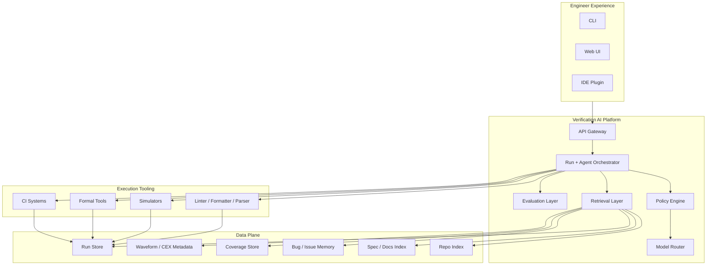
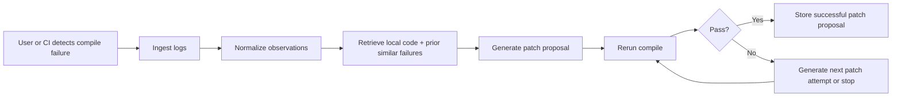
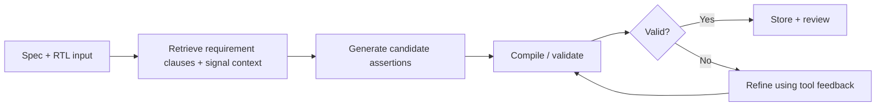

# Codex Handoff Bundle
## Open Verification AI Platform

This bundle combines the master strategic plan and the product specification into a single markdown file.

---

# Open Verification AI Platform for ASIC, FPGA, and RTL Teams
## Master Strategic Plan and Codex Build Blueprint

Version: 1.0  
Date: 2026-04-07  
Authoring intent: This document is designed to be committed into the repository and used as a master instruction file for engineering, planning, and Codex-assisted implementation.

---

## 1. Executive Summary

We are building an open, developer-first AI platform for hardware verification teams.

The core thesis is simple:

> The best opportunity in AI for ASIC, FPGA, and RTL verification is not "an LLM that writes Verilog."  
> The real opportunity is an orchestration layer that makes AI useful, measurable, safe, and deeply integrated with actual verification workflows.

Verification engineers do not primarily need a flashy chat interface. They need a system that helps them move faster through the highest-friction parts of verification work:

- turning specs into assertions, checks, and test plans
- creating and refining testbench scaffolding
- triaging regressions and narrowing root causes
- closing coverage with higher signal and less wasted time
- using organizational knowledge without manually digging through docs, prior bugs, logs, and internal examples

This platform will act as an **AI operating layer for verification**, not as a replacement for simulators, formal tools, linters, or existing DV methodologies.

The system will combine:

- tool integration
- RAG over code, specs, logs, coverage, bugs, and prior runs
- agent workflows with deterministic validation gates
- structured run storage and replay
- privacy-aware model routing
- benchmarked evaluation and measurement
- support for both open and enterprise tool stacks

The product should become notable because it solves the real bottleneck in the space:

**shortening time-to-signal in verification, with evidence.**

That means the platform must make engineers faster at getting from:
- a spec to a valid assertion
- a failing regression to a credible root-cause hypothesis
- a coverage hole to a sensible next action
- a broken generated artifact to a validated repair

If done well, this becomes:
- a highly credible open-source platform
- a useful internal tool for companies
- a benchmark and evaluation framework others cite
- a launchpad for deeper enterprise offerings later

---

## 2. Strategic Thesis

### 2.1 The Real Product Opportunity

Do **not** build "ChatGPT for verification."

Do build:

> **An open verification orchestration platform that uses LLMs, tool feedback, and retrieval to accelerate real verification workflows.**

This platform should sit between:
- engineers
- design/spec repositories
- simulators, linters, formal tools, and CI
- internal knowledge sources
- local or remote models

The system should help users answer:

- What should I verify next?
- What does this failure likely mean?
- Can you generate a first draft of the assertion or testbench for this requirement?
- Why is this compile or sim run failing?
- Which past failures look similar?
- Which coverage holes are likely real vs unreachable?
- What is the smallest next patch I should try?

### 2.2 Core Value Proposition

The platform creates value by reducing wasted engineering time across repeated verification loops.

It should reduce:

- manual searching across specs, logs, and prior bugs
- repetitive scaffold writing
- dead-end debugging attempts
- ungrounded prompt experiments
- copy-paste use of external AI tools with no validation or privacy guarantees

It should increase:

- grounded suggestions
- compile/sim/proof pass rates after iteration
- triage speed
- assertion and test authoring velocity
- organizational memory reuse
- trust in AI-generated output

### 2.3 What Makes This Different

Most AI coding products optimize for software generation.  
This platform must optimize for **verification workflows under deterministic constraints**.

That means:

- every useful AI action is tied to real tool output
- generated artifacts are validated before being trusted
- logs, traces, counterexamples, and coverage are first-class citizens
- agent loops operate over structured run artifacts, not just text prompts
- privacy and deployment flexibility matter from day one

---

## 3. Product Vision

### 3.1 Vision Statement

Build the open-source AI operating layer for hardware verification teams.

### 3.2 Mission Statement

Help verification engineers get to the next correct action faster.

### 3.3 Product Tagline Candidates

- Open AI infrastructure for hardware verification teams
- The orchestration layer for AI-assisted verification
- Shorten time-to-signal in RTL verification
- Grounded AI for verification workflows
- Tool-integrated AI for ASIC and FPGA verification

---

## 4. Product Principles

These principles must drive every design choice.

### 4.1 Tool-grounded over prompt-only
The system must prefer real tool feedback over pure language reasoning.

### 4.2 Assistive before autonomous
The platform should improve engineer speed and judgment before attempting full autonomy.

### 4.3 Deterministic gates before trust
Lint, compile, simulate, and formal checks are the acceptance boundary.

### 4.4 Data plane first
Runs, logs, artifacts, coverage, traces, and prior outcomes must be structured and queryable.

### 4.5 Privacy by construction
Support local models, private corpora, controlled retrieval, and auditable routing.

### 4.6 Evaluation-native
Every major feature should be benchmarkable and regression-testable.

### 4.7 Open-core ecosystem strategy
Make the platform useful on open tooling first, while enabling optional enterprise integrations.

---

## 5. Users and Personas

### 5.1 Primary Users

#### Verification Engineer
Needs help writing assertions, tests, triaging regressions, and understanding failures.

#### Design Verification Lead
Needs productivity gains, consistent workflows, and measurable improvements across a team.

#### Formal Verification Engineer
Needs help drafting properties, understanding counterexamples, and managing proof loops.

#### RTL Designer
Needs quick triage, design-intent lookup, and fast feedback on issues surfacing in verification.

#### EDA / Productivity / CAD Engineer
Needs a maintainable platform that integrates with CI, simulators, logs, and internal infrastructure.

### 5.2 Secondary Users

- FPGA engineers using mixed sim/test workflows
- researchers studying hardware-centric LLM evaluation
- open-source hardware teams who want practical AI tooling
- internal platform teams supporting design and verification orgs

---

## 6. Jobs To Be Done

### 6.1 Core Jobs

1. Given a spec section and module context, draft candidate assertions.
2. Given a DUT and interface description, draft testbench scaffolding.
3. Given failing logs and prior history, summarize likely failure clusters.
4. Given compile errors, repair code iteratively until it passes.
5. Given coverage holes, suggest next tests/assertions or classify likely unreachable items.
6. Given organizational knowledge spread across docs and repos, retrieve the most relevant material with citations.
7. Given a bug report or regression issue, find similar past cases and likely fixes.

### 6.2 High-Value Workflows

- spec to SVA
- spec to cocotb
- compile-error repair
- regression triage
- counterexample explanation
- coverage closure planning
- bug summarization and similarity search
- design-intent Q&A grounded in repo and docs

---

## 7. Non-Goals

These are explicitly out of scope for early versions.

- replacing simulators or formal engines
- claiming fully autonomous verification
- generating entire industrial UVM environments end-to-end with no human oversight
- shipping a generic chatbot detached from tool outputs
- optimizing for raw RTL generation as the flagship use case
- hiding evaluation details or relying on anecdotal claims
- requiring one specific model vendor or one cloud deployment model

---

## 8. Product Scope

### 8.1 What the Platform Is

The platform is a combination of:

- a verification data plane
- a tool integration layer
- a retrieval layer
- an agent execution layer
- a policy and routing layer
- a UX layer for engineers
- an evaluation layer for continuous measurement

### 8.2 What the Platform Is Not

It is not:

- just a chat interface
- just a benchmark
- just a simulator wrapper
- just a repo RAG tool
- just a code generator

---

## 9. System Overview



---

## 10. Product Pillars

### 10.1 Pillar A: Structured Verification Memory

Store and index:

- code
- specs
- interface docs
- prior assertions
- prior tests
- compile logs
- regression logs
- formal results
- counterexamples
- wave metadata
- bug reports
- coverage deltas
- patch attempts and outcomes

This is the foundation for everything else.

### 10.2 Pillar B: Tool-in-the-Loop AI

Every serious workflow must be grounded by external tool execution:

- lint
- compile
- simulate
- prove
- replay
- compare outputs

### 10.3 Pillar C: Retrieval and Context Engineering

The platform must retrieve the right context for the task, not dump entire files.

Examples:
- assertion generation retrieves spec clauses, signals, protocols, and prior similar assertions
- triage retrieves logs, nearby code, recent diffs, and similar failures
- coverage closure retrieves uncovered bins, exclusions, prior attempts, and known unreachable items

### 10.4 Pillar D: Measured Improvement

Every major capability must have:
- benchmark cases
- acceptance criteria
- offline evaluation
- release-over-release comparisons

### 10.5 Pillar E: Enterprise-Ready Governance

The platform must support:
- local-only model routing
- no-egress mode
- prompt redaction
- project-level policy controls
- audit logs for retrieval and model usage

---

## 11. Signature Workflows

## 11.1 Workflow 1: Spec to Assertion

**Input**
- spec section
- module/interface context
- signals and clocks/resets
- optional prior assertion library

**Process**
1. retrieve relevant spec and code chunks
2. generate candidate assertions
3. compile them into harness
4. run formal or sim validation
5. classify results as proved / failed / vacuous / inconclusive
6. refine based on counterexample or tool feedback

**Output**
- candidate SVA file
- explanation of each property
- validation result summary
- suggested edits if any property failed or is weak

## 11.2 Workflow 2: DUT to Testbench Scaffold

**Input**
- DUT
- module ports
- interface descriptions
- verification intent
- target framework such as cocotb or UVM skeleton mode

**Process**
1. retrieve interface and protocol context
2. generate initial scaffold
3. run compile/import validation
4. generate first-pass sanity tests
5. summarize missing pieces for human completion

**Output**
- scaffolded testbench
- smoke tests
- TODO list for constrained-random, scoreboard, monitors, and coverage

## 11.3 Workflow 3: Regression Triage

**Input**
- failing regression logs
- recent diffs
- prior similar failures
- coverage changes

**Process**
1. cluster failures by signature
2. summarize likely cause
3. identify impacted modules/files
4. surface similar historical runs
5. propose next debugging steps

**Output**
- failure cards
- cluster summaries
- likely cause ranking
- suggested next actions

## 11.4 Workflow 4: Compile / Sim Repair Loop

**Input**
- broken artifact
- compiler/simulator output
- surrounding repo context

**Process**
1. classify error
2. generate minimal patch
3. rerun
4. repeat until budget exhausted or green
5. present diff and rationale

**Output**
- proposed patch
- rerun history
- final status
- confidence estimate

## 11.5 Workflow 5: Coverage Closure Assistant

**Input**
- coverage report
- exclusions
- prior tests/assertions
- formal reachability signals if available

**Process**
1. identify top uncovered items
2. classify likely causes:
   - missing stimulus
   - missing checker
   - dead or unreachable
   - environment issue
3. propose next tests/assertions/exclusions
4. track deltas over time

**Output**
- prioritized closure plan
- proposed test/assertion candidates
- rationale and confidence

---

## 12. Technical Architecture

## 12.1 Core Components

### A. API Gateway
Handles UI and automation entrypoints.

### B. Orchestrator
Schedules agent runs, tool runs, workflow graphs, retries, and replay.

### C. Artifact Builder
Constructs candidate files:
- SVA
- tests
- patches
- harnesses
- config snippets

### D. Tool Adapters
Wrap linters, parsers, simulators, formal tools, CI runners, and repo operations.

### E. Retrieval Service
Indexes and retrieves code, docs, logs, bugs, coverage, and prior runs.

### F. Policy Engine
Controls:
- model routing
- egress rules
- redaction
- project permissions
- logging

### G. Evaluation Engine
Runs offline benchmarks and release validation.

### H. Run Store
Stores all execution artifacts and metadata.

---

## 13. Data Model

## 13.1 Core Objects

### VerificationProject
Represents a repo or verification workspace.

### DesignArtifact
Any file or generated artifact, such as:
- RTL file
- SVA file
- testbench file
- config file
- report

### VerificationRun
A concrete tool or workflow execution.

### Observation
A structured piece of evidence from a run.

Examples:
- compile error
- sim failure
- formal counterexample
- coverage delta
- linter finding

### AgentTask
A requested AI workflow step.

### PatchProposal
A candidate diff tied to evidence and validation attempts.

### RetrievalContext
The retrieved inputs used to ground a model call.

### BenchmarkCase
A replayable evaluation case with scoring logic.

---

## 14. Canonical Schemas

## 14.1 VerificationRun

```json
{
  "run_id": "run_001",
  "project_id": "proj_uart",
  "commit_sha": "abc123",
  "workflow_type": "compile_repair",
  "tool": {
    "kind": "simulator",
    "name": "verilator",
    "version": "5.x"
  },
  "inputs": {
    "files": ["rtl/uart.sv", "tb/tb_uart.py"],
    "seed": 42
  },
  "status": "failed",
  "started_at": "2026-04-07T12:00:00Z",
  "finished_at": "2026-04-07T12:01:12Z",
  "artifacts": {
    "log_uri": "store://runs/run_001/log.txt",
    "trace_uri": "store://runs/run_001/dump.vcd",
    "coverage_uri": "store://runs/run_001/coverage.json"
  }
}
```

## 14.2 Observation

```json
{
  "observation_id": "obs_001",
  "run_id": "run_001",
  "type": "compile_error",
  "signature": "SV_PARSE_EXPECTED_SEMICOLON",
  "file": "rtl/uart.sv",
  "line": 143,
  "message": "syntax error near always_ff",
  "severity": "error"
}
```

## 14.3 PatchProposal

```json
{
  "patch_id": "patch_001",
  "task_id": "task_001",
  "based_on_observations": ["obs_001"],
  "diff": "--- a/rtl/uart.sv\n+++ b/rtl/uart.sv\n@@ ...",
  "validation_attempts": [
    {
      "attempt": 1,
      "result": "compile_pass"
    }
  ],
  "status": "proposed"
}
```

## 14.4 BenchmarkCase

```json
{
  "benchmark_id": "spec_to_sva_001",
  "task_type": "spec_to_sva",
  "inputs": {
    "spec_uri": "bench://specs/fifo_reset.md",
    "rtl_uri": "bench://rtl/fifo.sv"
  },
  "expected_checks": {
    "parse_pass": true,
    "tool_acceptance": true
  },
  "scoring": {
    "weights": {
      "parse": 0.2,
      "validation": 0.5,
      "review_quality": 0.3
    }
  }
}
```

---

## 15. Model Strategy

## 15.1 Supported Modes

### Local-only mode
Use only local models and local vector stores.

### Hybrid mode
Use local retrieval and optional remote generation for allowed tasks.

### Remote mode
Allowed only where policies permit.

## 15.2 Model Roles

Use different models or configurations for different roles:

- retrieval summarization
- generation
- patch planning
- structured extraction
- judge/eval support
- low-cost classification

## 15.3 Why Model Abstraction Matters

We do not want the product thesis tied to one model vendor.

The moat is:
- workflow design
- run data
- evaluation
- retrieval quality
- tool integration
- structured hardware verification memory

---

## 16. Retrieval Architecture

## 16.1 Retrieval Targets

Index:
- source code
- specs
- markdown docs
- interface docs
- regression logs
- counterexample summaries
- coverage reports
- issue tickets
- prior generated assertions/tests
- historical patches

## 16.2 Chunking Strategy

Chunk types should differ by source:
- code by symbol/module/block
- specs by requirement clause/section
- logs by error block and signature
- issues by summary + root cause + fix
- coverage by unit/bin/metric region

## 16.3 Retrieval Pipeline

1. identify task type
2. select retrieval strategy
3. retrieve top-k candidates
4. rerank
5. build structured prompt context
6. preserve provenance for every chunk used

## 16.4 Why This Matters

The platform should never behave like a generic repo-chat tool that dumps random context.  
Retrieval must be task-aware.

---

## 17. Tool Integration Strategy

## 17.1 Open-First Targets

Early integrations should include:

- Verilator
- Icarus Verilog
- SymbiYosys
- Verible
- cocotb
- VUnit
- FuseSoC
- GHDL where relevant

## 17.2 Optional Enterprise Connectors

Later adapters may support:

- commercial simulators
- commercial formal tools
- vendor coverage/report exports
- issue trackers
- internal doc stores

These should be modular and optionally private.

## 17.3 Adapter Design

Each adapter should expose a common interface:

```python
class ToolAdapter:
    def prepare(self, task): ...
    def execute(self, inputs): ...
    def parse_outputs(self, raw_outputs): ...
    def normalize_observations(self, parsed): ...
    def build_artifacts(self, parsed): ...
```

---

## 18. Product UX

## 18.1 CLI-First

The CLI is the first-class interface for developer adoption.

Example commands:

```bash
ovai ask "What likely caused these 12 UART regressions?"
ovai gen-sva --spec docs/uart.md --rtl rtl/uart.sv
ovai gen-cocotb --dut rtl/fifo.sv --intent "basic smoke + reset + overflow"
ovai repair --run run_001
ovai triage --logs out/regressions/latest/
ovai coverage-plan --report cov/coverage.json
```

## 18.2 Web UI

The web UI should focus on:
- failure cards
- run history
- artifact review
- coverage guidance
- retrieved evidence inspection
- benchmark dashboards

## 18.3 IDE Plugin

Later, the IDE plugin should allow:
- inline assertion suggestions
- patch previews
- retrieved context side panel
- explain-this-error
- run-local-workflow shortcuts

---

## 19. Evaluation Strategy

## 19.1 Why Evaluation Is Central

This product becomes credible only if it proves measurable gains.

Every release should answer:
- Did compile repair improve?
- Did retrieval quality improve?
- Did triage quality regress?
- Are generated assertions more valid?
- Are we saving meaningful human time?

## 19.2 Evaluation Layers

### Offline micro-benchmarks
Fast repeated benchmark cases.

### Workflow benchmarks
End-to-end task replays.

### Macro-benchmarks
OpenTitan, Ibex, and similar real DV structures.

### Human pilot studies
Measure speed and usefulness with engineers.

## 19.3 Core Metrics

### Generation and Repair
- compile pass rate
- sim pass rate
- proof acceptance rate
- iterations to green
- time to first green

### Triage
- cluster purity
- top-k root cause hit rate
- mean time to triage
- accepted recommendations

### Retrieval
- recall@k
- rerank quality
- answer grounding quality
- citation usefulness

### Coverage Closure
- weekly coverage delta
- bug yield
- reduction in wasted test attempts
- exclusion quality

### Human Impact
- time saved per task
- perceived usefulness
- confidence in output
- acceptance rate of generated artifacts

---

## 20. Open Source Strategy

## 20.1 Open Source Goal

Become the standard open platform for grounded AI in verification.

## 20.2 What Should Be Open

- orchestration core
- data schemas
- adapters for open tools
- evaluation harness
- benchmark packaging
- baseline agents
- CLI
- docs and examples

## 20.3 What Can Be Optional Later

- enterprise integrations
- hosted services
- specialized dashboards
- org policy packs
- managed local deployment bundles

## 20.4 Community Strategy

To gain notability:
- publish realistic benchmarks
- publish reproducible evaluations
- support real open hardware projects
- contribute to open verification ecosystems
- share high-quality reference workflows
- avoid hype and publish hard numbers

---

## 21. Notability and Moat Strategy

## 21.1 What Makes the Project Notable

The project becomes notable if it does at least one of these exceptionally well:

1. the best open spec-to-SVA assistant with validation
2. the best open regression triage workflow for hardware verification
3. the best open benchmark suite for realistic AI-assisted DV
4. the best open verification memory / run store for agentic tooling

## 21.2 Real Moat

The moat is not the prompt.

The moat is the combination of:
- structured verification run data
- better retrieval over real verification artifacts
- deterministic validation loops
- benchmark credibility
- tool adapters and workflow depth
- adoption within real teams

## 21.3 Public Credibility Plan

To gain recognition:
- open-source the framework
- publish benchmark results
- write technical blogs with failure analysis
- show real examples on open projects
- compare approaches honestly
- document what fails, not just what works

---

## 22. Product Roadmap

## 22.1 MVP

### Objective
Ship a useful open-source baseline that already helps engineers.

### MVP Features
- project indexing
- run store
- open tool adapters
- CLI
- compile-error repair loop
- regression triage baseline
- basic repo/spec/log RAG
- artifact review UX in CLI/web
- evaluation harness for core tasks

### MVP Success Criteria
- users can run the platform on a real repo in under 30 minutes
- compile-repair workflow beats naive prompting
- retrieval is grounded and traceable
- regression triage produces usable summaries
- all major workflow runs are replayable

## 22.2 v1

### Objective
Move from useful baseline to serious workflow tool.

### v1 Features
- spec-to-SVA workflow
- DUT-to-cocotb workflow
- coverage closure assistant
- historical bug similarity search
- richer policy engine
- benchmark suite packaging
- dashboards for runs and metrics

### v1 Success Criteria
- assertion generation produces materially useful drafts
- cocotb scaffolding reduces startup time
- triage saves significant engineering time
- at least one realistic macro-benchmark is fully reproducible

## 22.3 v2

### Objective
Become the open research-and-practice standard.

### v2 Features
- local fine-tune support
- model routing policies
- enterprise connectors
- stronger coverage planning loops
- counterexample-guided property refinement
- learned prioritization for regressions/tests
- IDE plugins

### v2 Success Criteria
- measurable improvements on open macro-benchmarks
- adoption by at least several serious teams or projects
- external citations or reuse of benchmark / framework components

---

## 23. Reference Repository Structure

```text
open-verification-ai/
├── README.md
├── LICENSE
├── CONTRIBUTING.md
├── docs/
│   ├── strategy/
│   │   ├── MASTER_PLAN.md
│   │   ├── PRODUCT_SPEC.md
│   │   ├── ROADMAP.md
│   │   └── RESEARCH_BASIS.md
│   ├── architecture/
│   │   ├── system_overview.md
│   │   ├── data_model.md
│   │   ├── agent_workflows.md
│   │   ├── retrieval_design.md
│   │   └── policy_engine.md
│   ├── user_guides/
│   │   ├── quickstart.md
│   │   ├── cli.md
│   │   ├── triage.md
│   │   ├── gen_sva.md
│   │   └── gen_cocotb.md
│   └── evaluation/
│       ├── benchmark_suite.md
│       ├── metrics.md
│       └── release_validation.md
├── packages/
│   ├── core/
│   ├── api/
│   ├── cli/
│   ├── ui/
│   ├── schemas/
│   ├── retrieval/
│   ├── policy/
│   ├── eval/
│   ├── adapters/
│   │   ├── verilator/
│   │   ├── iverilog/
│   │   ├── symbiyosys/
│   │   ├── verible/
│   │   ├── cocotb/
│   │   ├── vunit/
│   │   └── enterprise/
│   └── agents/
│       ├── repair/
│       ├── triage/
│       ├── sva/
│       ├── cocotb/
│       └── coverage/
├── benchmarks/
│   ├── micro/
│   ├── macro/
│   ├── datasets/
│   └── scorecards/
├── examples/
│   ├── fifo/
│   ├── uart/
│   ├── opentitan/
│   └── ibex/
├── scripts/
├── tests/
├── docker/
└── .github/
```

---

## 24. Implementation Phases for Codex

## 24.1 Phase 0: Repository Bootstrap

### Deliverables
- monorepo layout
- package manager setup
- docs scaffold
- schema package
- adapter interface
- workflow registry
- local dev environment

### Codex Instructions
- create monorepo structure
- define shared schema package
- define tool adapter interfaces
- build CLI skeleton
- add docs placeholders
- set up test harness skeleton

## 24.2 Phase 1: Data Plane and Open Tool Adapters

### Deliverables
- run store
- artifact store abstraction
- log parser framework
- Verilator adapter
- Icarus adapter
- Verible adapter
- SymbiYosys adapter

### Codex Instructions
- implement run models
- implement normalized observation format
- implement containerized execution layer
- implement parsers for common compile/sim failures
- persist run metadata and artifacts

## 24.3 Phase 2: Retrieval and Baseline UX

### Deliverables
- code/spec/log indexers
- retrieval service
- CLI retrieval commands
- provenance-aware context assembly
- baseline web view for runs and failure cards

### Codex Instructions
- implement index pipelines by content type
- implement retrieval service with task-aware retrievers
- build context pack builders for triage, repair, and SVA generation
- expose retrieval through CLI and API

## 24.4 Phase 3: Repair and Triage Agents

### Deliverables
- compile-repair agent
- regression triage agent
- patch proposal format
- rerun and replay support
- evaluation cases for repair/triage

### Codex Instructions
- implement iterative repair loops
- integrate observation-based prompting
- build failure clusterer
- build patch review flow
- add replayable evaluation harness

## 24.5 Phase 4: Assertion and Testbench Generation

### Deliverables
- spec-to-SVA workflow
- DUT-to-cocotb workflow
- validation harnesses
- artifact explainers
- benchmark cases

### Codex Instructions
- implement assertion candidate generation pipeline
- integrate formal or sim validation loop
- implement cocotb scaffold generation
- generate TODO summaries for incomplete scaffolds
- add benchmark scoring

## 24.6 Phase 5: Coverage and Policy Layer

### Deliverables
- coverage ingestion
- closure planning agent
- policy controls
- model routing rules
- audit log support

### Codex Instructions
- define coverage schema
- implement coverage ranking and suggestion pipeline
- implement policy rule engine
- add local-only and no-egress modes
- attach audit metadata to all model calls

---

## 25. Acceptance Criteria by Major Capability

## 25.1 Compile Repair
- can ingest tool errors
- produces minimal diff
- reruns automatically
- tracks attempt history
- surfaces final validated outcome

## 25.2 Triage
- clusters repeated failures reliably
- identifies likely impacted files/modules
- cites evidence
- finds similar prior failures
- outputs actionable next steps

## 25.3 Assertion Generation
- generates parseable SVA
- associates each property with source requirement
- supports validation loop
- flags uncertainty and missing signals
- stores accepted properties for future retrieval

## 25.4 Testbench Scaffold
- generates valid project-compatible structure
- supports target framework modes
- produces at least a smoke-test level skeleton
- lists missing manual pieces clearly

## 25.5 Coverage Assistant
- ranks uncovered items
- distinguishes likely unreachable vs likely missing stimulus
- cites evidence from prior runs and coverage
- proposes concrete next actions

---

## 26. Risks and Mitigations

## 26.1 Risk: Generic AI output that looks smart but fails in practice
**Mitigation:** hard validation gates, run replays, benchmark scorecards.

## 26.2 Risk: Weak retrieval quality
**Mitigation:** task-aware chunking, reranking, provenance inspection, retrieval metrics.

## 26.3 Risk: Tool integration brittleness
**Mitigation:** normalized adapter interfaces, containerized environments, replay logs, golden test suites.

## 26.4 Risk: Privacy concerns block adoption
**Mitigation:** local-only mode, policy engine, no-egress configuration, audit logging.

## 26.5 Risk: Project becomes an over-scoped research toy
**Mitigation:** prioritize repair and triage first, with strong success criteria.

## 26.6 Risk: Overfitting to toy benchmarks
**Mitigation:** package macro-benchmarks based on realistic open verification environments.

---

## 27. Why This Project Can Matter

If successful, this platform changes the developer experience in verification by making AI useful where it currently fails most often:

- not as a magic code writer
- but as a grounded assistant operating on real verification evidence

It can matter because it improves the parts of verification that consume disproportionate time:
- setup
- search
- triage
- refinement
- repeated debugging loops

It can become notable because the space still needs:
- open, credible, tool-integrated platforms
- realistic evaluation
- reproducible benchmarks
- privacy-aware enterprise-ready architecture
- stronger open infrastructure for agentic verification workflows

---

## 28. Final Recommendation

Build this as:

> **Open-source AI infrastructure for hardware verification teams**

Lead with:
1. run ingestion and verification memory
2. compile/sim grounded repair
3. regression triage
4. spec-to-SVA
5. DUT-to-cocotb
6. realistic benchmark and evaluation harness

That is the most credible wedge, the most useful path for real teams, and the strongest foundation for notability in the space.

---

## 29. Codex Operating Instructions

Use the following constraints when implementing this repository:

### Architectural rules
- prefer modular packages over monolithic apps
- all workflows must be replayable
- all external tool calls must be normalized into structured observations
- all model calls must support provenance and policy metadata
- no workflow should depend on a single model vendor
- evaluation support is required, not optional
- generated artifacts must always be reviewable by a human
- adapters must be testable in isolation
- storage abstractions must allow local and cloud backends

### Product rules
- optimize for verification velocity, not prompt cleverness
- prioritize repair and triage before broad autonomous generation
- support open tooling first
- keep enterprise connectors optional and modular
- preserve transparency at every step

### UX rules
- CLI is first-class
- keep workflows explicit
- show evidence for every recommendation
- never hide validation failures
- prefer concise summaries plus drill-down links or files

---

## 30. Suggested Next Files to Create

After this document, create these repository files next:

1. `docs/strategy/PRODUCT_SPEC.md`
2. `docs/strategy/ROADMAP.md`
3. `docs/architecture/data_model.md`
4. `docs/architecture/agent_workflows.md`
5. `docs/evaluation/benchmark_suite.md`
6. `docs/evaluation/metrics.md`
7. `packages/schemas/README.md`
8. `packages/adapters/README.md`
9. `packages/agents/README.md`
10. `README.md`

---

## 31. Appendix A: Initial Research Anchors

These are important research and ecosystem anchors for the product direction:

- ChipNeMo
- VerilogEval and later revisions
- RTLFixer
- MEIC
- VerilogCoder
- AutoBench
- VERT
- SANGAM
- AssertLLM
- OpenTitan DV methodology
- Ibex verification environment
- sv-tests
- Verilator
- SymbiYosys
- Verible
- cocotb
- VUnit
- FuseSoC

Use these as part of the public research basis and benchmark strategy.

---

## 32. Appendix B: First-Week Build Plan

### Day 1 to 2
- bootstrap repo
- define schemas
- define adapter interfaces
- set up CLI
- add documentation structure

### Day 3 to 4
- implement run store
- implement artifact store abstraction
- implement Verilator and Verible adapters
- add local container execution

### Day 5 to 6
- implement code/spec/log indexing
- implement retrieval service
- create failure card schema
- implement basic triage flow

### Day 7
- implement compile repair loop
- create first benchmark cases
- produce first scorecard

---

## 33. Appendix C: Recommended Public Positioning

### One-sentence positioning
Open-source AI infrastructure for grounded hardware verification workflows.

### Short description
A tool-integrated AI platform for ASIC, FPGA, and RTL verification that combines retrieval, run memory, and deterministic validation loops to accelerate assertions, testbench creation, regression triage, and coverage closure.

### Differentiator
Built for verification workflows, not generic code generation.

---


---

# Product Specification
## Open Verification AI Platform

Version: 1.0  
Date: 2026-04-07  
Status: Draft for implementation  
Audience: Founders, engineers, Codex, contributors, potential design partners

---

## 1. Product Overview

### Product Name
Open Verification AI Platform

### Category
Developer tooling / verification productivity / AI infrastructure for hardware engineering

### One-line Summary
A tool-integrated AI platform that helps hardware verification teams generate assertions and tests, triage failures, repair broken artifacts, and close coverage faster using retrieval, structured run memory, and deterministic validation loops.

---

## 2. Problem Statement

Hardware verification work is expensive, repetitive, and highly context-heavy.

Engineers regularly spend large amounts of time on:
- reading specs and matching them to code
- writing boilerplate and scaffolding for testbenches
- drafting assertions from intent
- triaging repeated regression failures
- understanding compile and sim errors
- revisiting old failures and rediscovering prior fixes
- deciding what to verify next for coverage closure

Generic AI coding tools do not solve this well because they are usually:
- weakly grounded in verification artifacts
- disconnected from simulators and formal tools
- unaware of prior run history
- poor at surfacing evidence
- unfit for privacy-sensitive proprietary RTL and specs

The product exists to solve this by creating a hardware-verification-native AI operating layer.

---

## 3. Product Goals

## 3.1 Primary Goal
Reduce time-to-signal for verification engineers.

## 3.2 Secondary Goals
- improve speed of assertion drafting
- improve speed of testbench setup
- reduce time spent triaging regressions
- improve first-pass usefulness of generated artifacts
- provide reusable organizational memory for verification work
- create measurable, benchmarked productivity gains

## 3.3 Strategic Goal
Become the standard open platform for grounded AI in ASIC/FPGA/RTL verification workflows.

---

## 4. Non-Goals

- replacing existing simulators or formal tools
- full autonomous verification with no human review
- being a general-purpose LLM IDE assistant
- optimizing purely for raw RTL generation
- requiring closed commercial tools to be useful
- forcing cloud-only deployment

---

## 5. Target Users

## 5.1 Primary Personas

### Verification Engineer
Wants help with assertions, tests, failures, logs, and coverage decisions.

### DV Lead
Wants measurable team productivity improvements and consistent workflows.

### Formal Engineer
Wants property generation, counterexample explanation, and proof-loop assistance.

### CAD / Productivity Engineer
Wants maintainable internal infrastructure that integrates with tools and CI.

## 5.2 Secondary Personas

### RTL Designer
Needs fast design-context lookup and issue triage.

### Researcher / Open Hardware Contributor
Needs benchmarked, reproducible, hardware-aware AI tooling.

---

## 6. Core Use Cases

## 6.1 Spec to Assertion
Given a spec section and module context, generate and validate candidate assertions.

## 6.2 DUT to Testbench Scaffold
Given a DUT and interface description, generate a cocotb or minimal framework scaffold.

## 6.3 Regression Triage
Given failing logs and historical context, summarize likely failure clusters and probable causes.

## 6.4 Compile / Sim Repair
Given broken generated or human-written artifacts, propose minimal fixes and validate them through reruns.

## 6.5 Coverage Closure Guidance
Given uncovered items and prior attempts, suggest the next best assertions, tests, or exclusions.

## 6.6 Verification Memory Search
Answer verification questions grounded in code, docs, logs, bugs, and prior runs.

---

## 7. User Stories

### Assertions
- As a verification engineer, I want to point the system at a spec section and module so I can get candidate assertions instead of writing them all from scratch.
- As a formal engineer, I want counterexample-driven refinement so I can improve properties faster.

### Testbenches
- As a verification engineer, I want a valid cocotb scaffold so I can start from a grounded baseline rather than a blank file.
- As a DV lead, I want scaffolds to follow our project structure and conventions.

### Triage
- As a verification engineer, I want repeated failures grouped together so I do not waste time reading duplicate logs.
- As a designer, I want the most likely impacted file or module surfaced quickly.

### Repair
- As a developer, I want compile and sim errors translated into minimal candidate patches.
- As a reviewer, I want every proposed patch tied to evidence and rerun status.

### Coverage
- As a DV lead, I want to know which uncovered items are most worth attacking next.
- As an engineer, I want to distinguish likely unreachable bins from likely missing stimulus.

---

## 8. Functional Requirements

## 8.1 Project Ingestion
The system must:
- ingest one or more repositories or workspaces
- index code, specs, docs, and metadata
- support refresh on commit or schedule
- maintain project-level configuration

## 8.2 Run Management
The system must:
- store structured run records
- attach artifacts, logs, traces, coverage, and observations
- support replay and rerun
- preserve commit and environment metadata

## 8.3 Retrieval
The system must:
- retrieve task-relevant context from code, docs, logs, bugs, and prior runs
- preserve provenance for retrieved chunks
- expose retrieved evidence to users

## 8.4 Tool Integration
The system must:
- integrate with open lint, parse, sim, and formal tooling first
- normalize tool outputs into structured observations
- support modular adapters for future tools

## 8.5 Agent Workflows
The system must support:
- compile repair workflow
- regression triage workflow
- spec-to-SVA workflow
- DUT-to-testbench scaffold workflow
- coverage planning workflow

## 8.6 Policy and Routing
The system must:
- support local-only mode
- support no-egress mode
- allow per-project model routing rules
- support audit logging

## 8.7 Evaluation
The system must:
- support offline benchmark execution
- support scoring and release-over-release comparisons
- support golden cases for major workflows

---

## 9. Non-Functional Requirements

## 9.1 Reliability
- workflow runs must be replayable
- adapters must be deterministic where possible
- failures must be stored and inspectable

## 9.2 Security
- support local model execution
- protect project boundaries
- support access control at project/workspace level
- attach audit metadata to model calls and retrieval

## 9.3 Performance
- retrieval must be fast enough for interactive use
- tool execution orchestration must support queued runs
- large logs should be chunked and processed incrementally

## 9.4 Observability
- all workflows should produce structured telemetry
- every recommendation should be explainable by source evidence
- system metrics should support debugging and evaluation

## 9.5 Extensibility
- new tools must be addable through adapters
- new workflows must be addable without rewriting the system core
- schema versioning must be supported

---

## 10. Feature Definition

## 10.1 Feature: Verification Memory

### Description
A search and retrieval layer over:
- RTL
- specs
- docs
- issues
- prior assertions/tests
- logs
- coverage
- run history

### Inputs
- repo content
- docs
- historical artifacts
- tool outputs

### Outputs
- citations
- ranked evidence
- answer context packs

### Acceptance Criteria
- user can query repo + verification memory from CLI and UI
- answers cite evidence
- retrieval can target task-specific views

---

## 10.2 Feature: Compile Repair Agent

### Description
Given a compile or parse failure, propose minimal changes and rerun validation.

### Inputs
- source files
- compile logs
- observation metadata

### Outputs
- candidate patch
- rerun result
- evidence summary

### Acceptance Criteria
- supports at least one open simulator/compiler path
- tracks retries and status
- presents diff and outcome clearly

---

## 10.3 Feature: Regression Triage

### Description
Cluster related failures and produce failure cards with likely causes.

### Inputs
- regression logs
- recent diffs
- prior failures
- retrieved repo context

### Outputs
- clustered failure groups
- summaries
- likely impacted files/modules
- next-step suggestions

### Acceptance Criteria
- deduplicates repeated signatures
- summarizes failures clearly
- surfaces historical analogs

---

## 10.4 Feature: Spec-to-SVA

### Description
Generate candidate assertions from requirements and validate them.

### Inputs
- spec sections
- module context
- signal lists
- optional protocol/library context

### Outputs
- SVA candidates
- per-property rationale
- validation outcome

### Acceptance Criteria
- produces parseable candidate properties
- associates properties with requirements
- runs at least one validation path

---

## 10.5 Feature: DUT-to-cocotb Scaffold

### Description
Generate a grounded starter testbench for a DUT.

### Inputs
- DUT
- ports
- interface intent
- project conventions

### Outputs
- scaffolded cocotb files
- smoke tests
- TODO summary

### Acceptance Criteria
- structure matches project expectations
- generated scaffold is syntactically usable
- includes minimum useful tests

---

## 10.6 Feature: Coverage Closure Assistant

### Description
Analyze uncovered regions and propose next actions.

### Inputs
- coverage reports
- prior tests/assertions
- exclusions
- reachable/unreachable hints if available

### Outputs
- prioritized closure plan
- next test/assertion suggestions
- likely exclusion candidates

### Acceptance Criteria
- ranks opportunities with rationale
- distinguishes likely root categories
- surfaces actionable next steps

---

## 11. Workflow Definitions

## 11.1 Compile Repair Workflow



## 11.2 Triage Workflow


## 11.3 Spec-to-SVA Workflow



---

## 12. Data Model Requirements

The product must define stable, versioned schemas for:

- Project
- Artifact
- Run
- Observation
- RetrievalContext
- AgentTask
- PatchProposal
- BenchmarkCase
- CoverageItem
- FailureCluster

These schemas should be consumed by:
- CLI
- API
- UI
- adapters
- evaluation harness
- agent workflows

---

## 13. API Design Requirements

The API should support:

### Project APIs
- create project
- refresh index
- fetch project config
- update tool/model policy

### Retrieval APIs
- query memory
- fetch evidence pack
- fetch citations and sources

### Run APIs
- create run
- get run
- list runs
- replay run
- fetch run artifacts

### Workflow APIs
- start triage
- start repair
- start spec-to-SVA
- start scaffold generation
- start coverage analysis

### Evaluation APIs
- run benchmark suite
- fetch scorecards
- compare release metrics

---

## 14. UX Requirements

## 14.1 CLI Requirements
CLI must support:
- local workflow invocation
- batch invocation from CI
- structured output modes
- human-readable summaries
- output artifact locations

## 14.2 Web UI Requirements
The web UI should include:
- project dashboard
- run timeline
- failure cards
- artifact review views
- evidence inspection
- benchmark dashboards

## 14.3 Evidence Transparency
All user-facing recommendations must show:
- which files or artifacts were used
- what tool outputs supported the suggestion
- validation status where available

---

## 15. MVP Scope

## 15.1 Included
- repository indexing
- run store
- basic retrieval
- Verilator / Icarus / Verible / SymbiYosys adapter layer
- compile repair agent
- regression triage baseline
- CLI-first UX
- initial evaluation harness

## 15.2 Excluded
- full IDE plugin
- advanced coverage closure
- broad enterprise connectors
- fine-tuning pipeline
- sophisticated UVM generation

---

## 16. MVP Success Metrics

The MVP is successful if:

1. a user can install and run it on an open repo
2. compile repair works end-to-end on a benchmark subset
3. regression triage produces useful clustered summaries
4. retrieval answers are grounded in repo/spec/log evidence
5. major workflow runs are replayable and benchmarkable

---

## 17. Release Plan

## 17.1 Release 0.1
- repo bootstrap
- schemas
- adapters
- run store
- CLI shell

## 17.2 Release 0.2
- retrieval
- evidence packs
- triage baseline
- compile repair

## 17.3 Release 0.3
- spec-to-SVA prototype
- artifact validation loop
- first benchmark scorecards

## 17.4 Release 0.4
- DUT-to-cocotb scaffold
- web dashboard
- improved evaluation reporting

## 17.5 Release 1.0
- integrated platform with stable data model
- benchmark suite
- policy engine baseline
- publishable documentation and examples

---

## 18. Risks

### Over-scope
Mitigation: start with repair and triage.

### Poor trust
Mitigation: show evidence, validation, and uncertainty.

### Weak benchmarks
Mitigation: build both micro and macro benchmark layers.

### Tool brittleness
Mitigation: strict adapter abstraction and replay.

### Privacy blockers
Mitigation: local-only and no-egress modes from early design.

---

## 19. Open Source Product Strategy

### Why open source
- accelerates adoption
- builds public credibility
- supports benchmark standardization
- encourages external contribution
- differentiates from vendor-locked products

### Initial open-source deliverables
- CLI
- adapters for open tools
- core schemas
- run store
- retrieval layer
- repair and triage workflows
- evaluation harness

---

## 20. Product Positioning

### Positioning Statement
For hardware verification teams that want AI assistance without giving up rigor, Open Verification AI Platform is a grounded verification workflow system that integrates retrieval, tooling, and validation to accelerate assertions, tests, and triage.

### What We Are Not
- generic repo chat
- generic code copilot
- closed black-box agent
- simulator replacement

### What We Are
- verification-native
- tool-integrated
- evidence-based
- evaluation-driven
- open and extensible

---

## 21. Implementation Notes for Codex

When implementing against this spec:

- prioritize clear interfaces over premature sophistication
- keep packages small and composable
- put schema stability before UI polish
- build replay and observability early
- ensure each major feature has at least one benchmark case
- write docs alongside implementation
- keep enterprise-specific work isolated from core packages

---

## 22. Immediate Next Deliverables

After this spec, implement in order:

1. schema package
2. adapter interface package
3. run store
4. CLI
5. Verilator adapter
6. Verible adapter
7. retrieval indexers
8. triage workflow
9. repair workflow
10. first benchmark cases

---

## 23. Definition of Done

A feature is done when:
- it has code
- it has tests
- it has docs
- it has structured outputs
- it integrates with run storage
- it supports evaluation
- it surfaces evidence to the user

---

## 24. Final Product Statement

This product should become the open, credible, workflow-first AI layer for hardware verification.

It succeeds not by pretending to replace engineers, but by making expert engineers faster, more grounded, and better supported by their tools and organizational knowledge.

---
