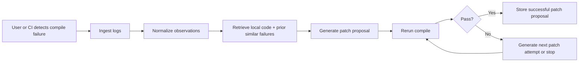
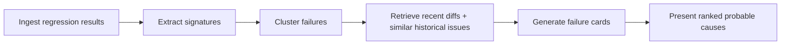
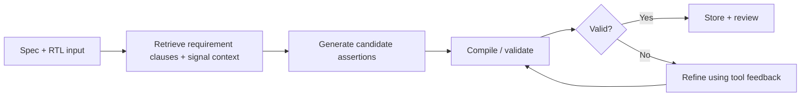

# Product Specification
## Open Verification AI Platform

Version: 1.0  
Date: 2026-04-07  
Status: Draft for implementation  
Audience: Founders, engineers, Codex, contributors, potential design partners

---

## 1. Product Overview

### Product Name
Open Verification AI Platform

### Category
Developer tooling / verification productivity / AI infrastructure for hardware engineering

### One-line Summary
A tool-integrated AI platform that helps hardware verification teams generate assertions and tests, triage failures, repair broken artifacts, and close coverage faster using retrieval, structured run memory, and deterministic validation loops.

---

## 2. Problem Statement

Hardware verification work is expensive, repetitive, and highly context-heavy.

Engineers regularly spend large amounts of time on:
- reading specs and matching them to code
- writing boilerplate and scaffolding for testbenches
- drafting assertions from intent
- triaging repeated regression failures
- understanding compile and sim errors
- revisiting old failures and rediscovering prior fixes
- deciding what to verify next for coverage closure

Generic AI coding tools do not solve this well because they are usually:
- weakly grounded in verification artifacts
- disconnected from simulators and formal tools
- unaware of prior run history
- poor at surfacing evidence
- unfit for privacy-sensitive proprietary RTL and specs

The product exists to solve this by creating a hardware-verification-native AI operating layer.

---

## 3. Product Goals

## 3.1 Primary Goal
Reduce time-to-signal for verification engineers.

## 3.2 Secondary Goals
- improve speed of assertion drafting
- improve speed of testbench setup
- reduce time spent triaging regressions
- improve first-pass usefulness of generated artifacts
- provide reusable organizational memory for verification work
- create measurable, benchmarked productivity gains

## 3.3 Strategic Goal
Become the standard open platform for grounded AI in ASIC/FPGA/RTL verification workflows.

---

## 4. Non-Goals

- replacing existing simulators or formal tools
- full autonomous verification with no human review
- being a general-purpose LLM IDE assistant
- optimizing purely for raw RTL generation
- requiring closed commercial tools to be useful
- forcing cloud-only deployment

---

## 5. Target Users

## 5.1 Primary Personas

### Verification Engineer
Wants help with assertions, tests, failures, logs, and coverage decisions.

### DV Lead
Wants measurable team productivity improvements and consistent workflows.

### Formal Engineer
Wants property generation, counterexample explanation, and proof-loop assistance.

### CAD / Productivity Engineer
Wants maintainable internal infrastructure that integrates with tools and CI.

## 5.2 Secondary Personas

### RTL Designer
Needs fast design-context lookup and issue triage.

### Researcher / Open Hardware Contributor
Needs benchmarked, reproducible, hardware-aware AI tooling.

---

## 6. Core Use Cases

## 6.1 Spec to Assertion
Given a spec section and module context, generate and validate candidate assertions.

## 6.2 DUT to Testbench Scaffold
Given a DUT and interface description, generate a cocotb or minimal framework scaffold.

## 6.3 Regression Triage
Given failing logs and historical context, summarize likely failure clusters and probable causes.

## 6.4 Compile / Sim Repair
Given broken generated or human-written artifacts, propose minimal fixes and validate them through reruns.

## 6.5 Coverage Closure Guidance
Given uncovered items and prior attempts, suggest the next best assertions, tests, or exclusions.

## 6.6 Verification Memory Search
Answer verification questions grounded in code, docs, logs, bugs, and prior runs.

---

## 7. User Stories

### Assertions
- As a verification engineer, I want to point the system at a spec section and module so I can get candidate assertions instead of writing them all from scratch.
- As a formal engineer, I want counterexample-driven refinement so I can improve properties faster.

### Testbenches
- As a verification engineer, I want a valid cocotb scaffold so I can start from a grounded baseline rather than a blank file.
- As a DV lead, I want scaffolds to follow our project structure and conventions.

### Triage
- As a verification engineer, I want repeated failures grouped together so I do not waste time reading duplicate logs.
- As a designer, I want the most likely impacted file or module surfaced quickly.

### Repair
- As a developer, I want compile and sim errors translated into minimal candidate patches.
- As a reviewer, I want every proposed patch tied to evidence and rerun status.

### Coverage
- As a DV lead, I want to know which uncovered items are most worth attacking next.
- As an engineer, I want to distinguish likely unreachable bins from likely missing stimulus.

---

## 8. Functional Requirements

## 8.1 Project Ingestion
The system must:
- ingest one or more repositories or workspaces
- index code, specs, docs, and metadata
- support refresh on commit or schedule
- maintain project-level configuration

## 8.2 Run Management
The system must:
- store structured run records
- attach artifacts, logs, traces, coverage, and observations
- support replay and rerun
- preserve commit and environment metadata

## 8.3 Retrieval
The system must:
- retrieve task-relevant context from code, docs, logs, bugs, and prior runs
- preserve provenance for retrieved chunks
- expose retrieved evidence to users

## 8.4 Tool Integration
The system must:
- integrate with open lint, parse, sim, and formal tooling first
- normalize tool outputs into structured observations
- support modular adapters for future tools

## 8.5 Agent Workflows
The system must support:
- compile repair workflow
- regression triage workflow
- spec-to-SVA workflow
- DUT-to-testbench scaffold workflow
- coverage planning workflow

## 8.6 Policy and Routing
The system must:
- support local-only mode
- support no-egress mode
- allow per-project model routing rules
- support audit logging

## 8.7 Evaluation
The system must:
- support offline benchmark execution
- support scoring and release-over-release comparisons
- support golden cases for major workflows

---

## 9. Non-Functional Requirements

## 9.1 Reliability
- workflow runs must be replayable
- adapters must be deterministic where possible
- failures must be stored and inspectable

## 9.2 Security
- support local model execution
- protect project boundaries
- support access control at project/workspace level
- attach audit metadata to model calls and retrieval

## 9.3 Performance
- retrieval must be fast enough for interactive use
- tool execution orchestration must support queued runs
- large logs should be chunked and processed incrementally

## 9.4 Observability
- all workflows should produce structured telemetry
- every recommendation should be explainable by source evidence
- system metrics should support debugging and evaluation

## 9.5 Extensibility
- new tools must be addable through adapters
- new workflows must be addable without rewriting the system core
- schema versioning must be supported

---

## 10. Feature Definition

## 10.1 Feature: Verification Memory

### Description
A search and retrieval layer over:
- RTL
- specs
- docs
- issues
- prior assertions/tests
- logs
- coverage
- run history

### Inputs
- repo content
- docs
- historical artifacts
- tool outputs

### Outputs
- citations
- ranked evidence
- answer context packs

### Acceptance Criteria
- user can query repo + verification memory from CLI and UI
- answers cite evidence
- retrieval can target task-specific views

---

## 10.2 Feature: Compile Repair Agent

### Description
Given a compile or parse failure, propose minimal changes and rerun validation.

### Inputs
- source files
- compile logs
- observation metadata

### Outputs
- candidate patch
- rerun result
- evidence summary

### Acceptance Criteria
- supports at least one open simulator/compiler path
- tracks retries and status
- presents diff and outcome clearly

---

## 10.3 Feature: Regression Triage

### Description
Cluster related failures and produce failure cards with likely causes.

### Inputs
- regression logs
- recent diffs
- prior failures
- retrieved repo context

### Outputs
- clustered failure groups
- summaries
- likely impacted files/modules
- next-step suggestions

### Acceptance Criteria
- deduplicates repeated signatures
- summarizes failures clearly
- surfaces historical analogs

---

## 10.4 Feature: Spec-to-SVA

### Description
Generate candidate assertions from requirements and validate them.

### Inputs
- spec sections
- module context
- signal lists
- optional protocol/library context

### Outputs
- SVA candidates
- per-property rationale
- validation outcome

### Acceptance Criteria
- produces parseable candidate properties
- associates properties with requirements
- runs at least one validation path

---

## 10.5 Feature: DUT-to-cocotb Scaffold

### Description
Generate a grounded starter testbench for a DUT.

### Inputs
- DUT
- ports
- interface intent
- project conventions

### Outputs
- scaffolded cocotb files
- smoke tests
- TODO summary

### Acceptance Criteria
- structure matches project expectations
- generated scaffold is syntactically usable
- includes minimum useful tests

---

## 10.6 Feature: Coverage Closure Assistant

### Description
Analyze uncovered regions and propose next actions.

### Inputs
- coverage reports
- prior tests/assertions
- exclusions
- reachable/unreachable hints if available

### Outputs
- prioritized closure plan
- next test/assertion suggestions
- likely exclusion candidates

### Acceptance Criteria
- ranks opportunities with rationale
- distinguishes likely root categories
- surfaces actionable next steps

---

## 11. Workflow Definitions

## 11.1 Compile Repair Workflow

## 11.2 Triage Workflow

## 11.3 Spec-to-SVA Workflow

---

## 12. Data Model Requirements

The product must define stable, versioned schemas for:

- Project
- Artifact
- Run
- Observation
- RetrievalContext
- AgentTask
- PatchProposal
- BenchmarkCase
- CoverageItem
- FailureCluster

These schemas should be consumed by:
- CLI
- API
- UI
- adapters
- evaluation harness
- agent workflows

---

## 13. API Design Requirements

The API should support:

### Project APIs
- create project
- refresh index
- fetch project config
- update tool/model policy

### Retrieval APIs
- query memory
- fetch evidence pack
- fetch citations and sources

### Run APIs
- create run
- get run
- list runs
- replay run
- fetch run artifacts

### Workflow APIs
- start triage
- start repair
- start spec-to-SVA
- start scaffold generation
- start coverage analysis

### Evaluation APIs
- run benchmark suite
- fetch scorecards
- compare release metrics

---

## 14. UX Requirements

## 14.1 CLI Requirements
CLI must support:
- local workflow invocation
- batch invocation from CI
- structured output modes
- human-readable summaries
- output artifact locations

## 14.2 Web UI Requirements
The web UI should include:
- project dashboard
- run timeline
- failure cards
- artifact review views
- evidence inspection
- benchmark dashboards

## 14.3 Evidence Transparency
All user-facing recommendations must show:
- which files or artifacts were used
- what tool outputs supported the suggestion
- validation status where available

---

## 15. MVP Scope

## 15.1 Included
- repository indexing
- run store
- basic retrieval
- Verilator / Icarus / Verible / SymbiYosys adapter layer
- compile repair agent
- regression triage baseline
- CLI-first UX
- initial evaluation harness

## 15.2 Excluded
- full IDE plugin
- advanced coverage closure
- broad enterprise connectors
- fine-tuning pipeline
- sophisticated UVM generation

---

## 16. MVP Success Metrics

The MVP is successful if:

1. a user can install and run it on an open repo
2. compile repair works end-to-end on a benchmark subset
3. regression triage produces useful clustered summaries
4. retrieval answers are grounded in repo/spec/log evidence
5. major workflow runs are replayable and benchmarkable

---

## 17. Release Plan

## 17.1 Release 0.1
- repo bootstrap
- schemas
- adapters
- run store
- CLI shell

## 17.2 Release 0.2
- retrieval
- evidence packs
- triage baseline
- compile repair

## 17.3 Release 0.3
- spec-to-SVA prototype
- artifact validation loop
- first benchmark scorecards

## 17.4 Release 0.4
- DUT-to-cocotb scaffold
- web dashboard
- improved evaluation reporting

## 17.5 Release 1.0
- integrated platform with stable data model
- benchmark suite
- policy engine baseline
- publishable documentation and examples

---

## 18. Risks

### Over-scope
Mitigation: start with repair and triage.

### Poor trust
Mitigation: show evidence, validation, and uncertainty.

### Weak benchmarks
Mitigation: build both micro and macro benchmark layers.

### Tool brittleness
Mitigation: strict adapter abstraction and replay.

### Privacy blockers
Mitigation: local-only and no-egress modes from early design.

---

## 19. Open Source Product Strategy

### Why open source
- accelerates adoption
- builds public credibility
- supports benchmark standardization
- encourages external contribution
- differentiates from vendor-locked products

### Initial open-source deliverables
- CLI
- adapters for open tools
- core schemas
- run store
- retrieval layer
- repair and triage workflows
- evaluation harness

---

## 20. Product Positioning

### Positioning Statement
For hardware verification teams that want AI assistance without giving up rigor, Open Verification AI Platform is a grounded verification workflow system that integrates retrieval, tooling, and validation to accelerate assertions, tests, and triage.

### What We Are Not
- generic repo chat
- generic code copilot
- closed black-box agent
- simulator replacement

### What We Are
- verification-native
- tool-integrated
- evidence-based
- evaluation-driven
- open and extensible

---

## 21. Implementation Notes for Codex

When implementing against this spec:

- prioritize clear interfaces over premature sophistication
- keep packages small and composable
- put schema stability before UI polish
- build replay and observability early
- ensure each major feature has at least one benchmark case
- write docs alongside implementation
- keep enterprise-specific work isolated from core packages

---

## 22. Immediate Next Deliverables

After this spec, implement in order:

1. schema package
2. adapter interface package
3. run store
4. CLI
5. Verilator adapter
6. Verible adapter
7. retrieval indexers
8. triage workflow
9. repair workflow
10. first benchmark cases

---

## 23. Definition of Done

A feature is done when:
- it has code
- it has tests
- it has docs
- it has structured outputs
- it integrates with run storage
- it supports evaluation
- it surfaces evidence to the user

---

## 24. Final Product Statement

This product should become the open, credible, workflow-first AI layer for hardware verification.

It succeeds not by pretending to replace engineers, but by making expert engineers faster, more grounded, and better supported by their tools and organizational knowledge.

---
