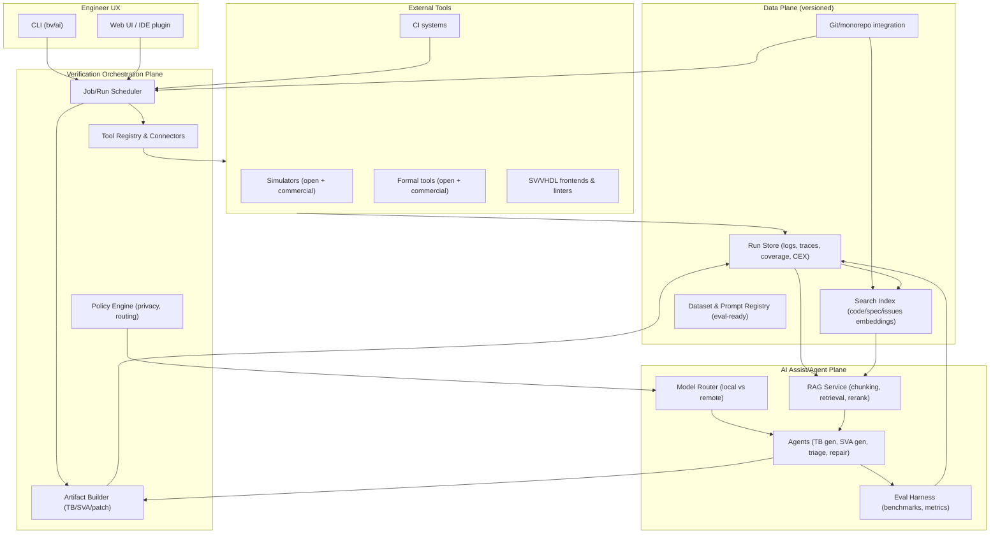
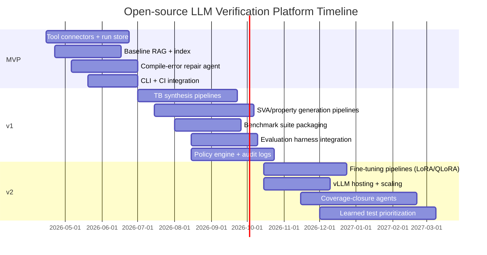

# Open-Source LLM Platform for Hardware Verification Engineering

## Executive summary

Modern ASIC/FPGA verification remains dominated by manual work—writing test plans, developing UVM/cocotb testbenches, authoring assertions, triaging regressions, and iterating on coverage closure—while industrial complexity continues to rise. A recent industry framing is that engineers can spend *up to ~70% of their time* writing and testing design code. citeturn22search7 This creates an unusually high-leverage opportunity for LLM- and agent-assisted workflows **if** the platform is engineered around (a) verifiability and tool-grounding, (b) strict data governance for proprietary RTL/specs, and (c) measurable impact via coverage, bug yield, and time-to-signal metrics.

Key findings from recent research and tooling:

- **LLMs can produce useful RTL/verification artifacts, but raw pass rates are often low without tool-in-the-loop validation.** VerilogEval established an automated harness to test generated Verilog for functional correctness via simulation against golden solutions, making pass/fail measurable (and enabling pass@k style scoring). citeturn0search1turn0search17 AutoBench reports that directly generating testbenches “suffers from a low pass rate,” and proposes a structured, self-checking generation/evaluation flow that improves pass@1. citeturn5search0
- **Tool-grounded “agents” and iterative repair loops are a dominant pattern.** RTLFixer targets the common failure mode that a large fraction of LLM-generated RTL errors are syntax-related, and proposes an LLM-driven fixing flow. citeturn0search2turn0search14 MEIC similarly positions iterative, toolchain-integrated debugging (compilers/simulators) as key to high fix rates and speedups over one-shot prompting. citeturn5search2turn25search7 VerilogCoder extends this direction with multi-agent planning and waveform/tool feedback. citeturn5search1turn5search17turn25search1
- **Assertion/property generation is rapidly advancing, with multiple 2024–2026 papers and datasets designed specifically for SVA generation and evaluation.** Recent examples include datasets and frameworks for SVA synthesis from specs and/or RTL (e.g., VERT dataset, SANGAM, Spec2Assertion, AssertLLM). citeturn0search3turn0search7turn4search13turn4search17
- **Commercial EDA vendors are productizing “AI for verification” primarily as workflow optimization + data/ML platforms + agentic orchestration**, rather than pure text generation: Cadence announced Verisium (AI-driven verification apps integrated with verification engines, built on a data/AI platform). citeturn22search0turn22search4 Synopsys positions ML as part of formal engine orchestration/regression/debug and highlights native integration between formal and simulation flows for coverage closure. citeturn22search1turn10search18 Siemens markets Questa One as “smart verification… powered by AI,” with explicit “agentic toolkit” messaging. citeturn22search2turn22search9turn22search6
- **A viable open-source platform should not attempt to “replace” simulators/formal tools.** Instead it should provide a secure orchestration plane and standardized data plane (runs, logs, coverage, traces, extracted design facts), plus pluggable “AI assistants/agents” that operate with hard constraints (lint/compile/sim/prove gates).

The remainder of this report proposes a rigorous blueprint: literature + patent landscape, tool comparisons, a reference architecture (RAG + tool connectors + dataset management + model hosting + governance), a prioritized roadmap (MVP → v1 → v2), and an evaluation/validation plan designed to produce publishable, audit-ready evidence of productivity gains.

## Problem framing and unspecified constraints

### Verification tasks that map well to LLM- and agent-assistance

SystemVerilog is explicitly defined as a unified design/specification/verification language that supports testbenches with coverage, assertions, object-oriented programming, and constrained random verification. citeturn21search2 That ecosystem creates several “LLM-addressable” verification tasks with clear input/output structure and measurable outcomes:

- **Natural-language/spec-to-artifact transformations**: specs → assertions, specs → testbench skeletons, specs → testplans/checklists. (Evidence: multiple recent works focus specifically on spec-to-assertion and spec-to-testbench generation.) citeturn4search13turn5search0  
- **Code synthesis with strict tool gating**: produce compilable/simulatable RTL or testbench code, then iterate until compilation + tests pass (VerilogEval, AutoBench, VerilogCoder, RTLFixer). citeturn0search1turn5search0turn5search1turn0search2  
- **Debug and repair of RTL/testbench failures**: parse errors, failing tests, counterexamples; use logs/waveforms as structured feedback signals (MEIC, VerilogCoder). citeturn5search2turn5search1  
- **Regression triage and bug summarization**: log clustering, failure signature extraction, “probable root cause” hypotheses grounded in prior issues and code context (ChipNeMo explicitly evaluated bug summarization/analysis as a chip-design LLM application). citeturn5search3turn0search12  

### Constraints the report cannot infer from the prompt

The requested platform design depends heavily on constraints that were not specified. This report therefore assumes a “configurable-by-deployment” architecture and calls out the key unknowns explicitly:

- **Target HDLs**: Verilog-2005 vs SystemVerilog (IEEE 1800), VHDL, SystemC, mixed-language. (SystemVerilog standard scope is broad. citeturn21search2)  
- **Target verification methodologies**: UVM (IEEE 1800.2), cocotb/Python, VUnit, internal frameworks. (UVM is positioned as an interoperability standard. citeturn21search3turn21search15; cocotb is Python coroutine-based co-simulation for VHDL/SystemVerilog. citeturn1search2)  
- **Tool availability**: open-source-only vs mixed commercial (formal/simulators). Commercial tools explicitly advertise ML/AI-driven capabilities, which affects integration strategy. citeturn2search0turn2search1turn22search2  
- **Deployment model**: on-prem only (IP sensitivity), air-gapped, private cloud, or hybrid. (Chip-design LLM work emphasizes training on internal corpora for productivity, highlighting why data governance matters. citeturn0search12turn0search8)  
- **Budget and team size**: determines whether to build custom fine-tunes, host models locally (e.g., vLLM), or rely on external APIs. (vLLM is designed for high-throughput inference/serving. citeturn17search1)  
- **Security/compliance**: export controls, customer NDAs, SOC2/ISO needs, data retention policies.  
- **Success definition**: “speed” could mean engineer-hours saved, wall-clock regression time reduced, bug yield increased, coverage improved, or earlier escape prevention.

The architecture and roadmap later in the report therefore include **configuration points** (HDL frontends, simulator/formal connectors, model backends, data policies) rather than assuming one fixed environment.

## Evidence base from recent research and patents

### Academic and preprint literature on LLMs for verification-adjacent tasks

The table below focuses on the last ~7 years, emphasizing works that (a) provide benchmarks/datasets or (b) integrate tools (simulators/formal) into the loop—both critical for building an engineering-grade platform.

| Item (primary source) | Purpose | Capabilities | Limitations observed/reported | License / status | Maturity | Integration points to reuse in a framework |
|---|---|---|---|---|---|---|
| **ChipNeMo: Domain-Adapted LLMs for Chip Design** citeturn0search12turn0search0 | Evaluate domain adaptation for chip-design LLM applications, including assistant Q&A, EDA script generation, and bug summarization/analysis. citeturn0search12turn5search3 | Uses domain adaptation techniques (custom tokenizers, continued pretraining, SFT, domain retrieval models). citeturn0search12 Reports productivity-oriented apps (assistant + bug analysis). citeturn0search12 | Trained/evaluated on internal corpora; not an open drop-in solution for other orgs without equivalent datasets and governance. citeturn0search12 | Research publication; model not generally released. citeturn0search8turn0search12 | High relevance conceptually; implementation details depend on proprietary data. | Strong template for **enterprise RAG + internal corpora connectors + bug DB summarization**, plus evaluation methodology. citeturn0search12 |
| **VerilogEval** citeturn0search1turn0search17 | Benchmark LLM Verilog generation with automated functional testing vs golden solutions. citeturn0search1 | Dataset of problems derived from HDLBits; harness auto-tests via simulation outputs; supports measuring functional correctness. citeturn0search1 | Evaluates on relatively small tasks compared to full SoC modules; reflects benchmark-design tradeoffs. citeturn0search1 | Open-source harness; repo contains MIT SPDX markers. citeturn0search17turn25search8 | Widely referenced benchmark; evolved to spec-to-RTL in later revisions. citeturn0search17turn25search9 | Directly reusable **evaluation harness pattern**: compile/sim gate + golden reference + pass@k scoring workflow. citeturn0search1 |
| **VerilogEval v2 improvements** (ACM + repo updates) citeturn0search13turn0search17turn25search9 | Extend benchmark toward spec-to-RTL and more realistic errors/failures. citeturn0search17turn25search9 | Adds spec-to-RTL tasks and analysis of common simulator failures. citeturn0search17 | Benchmarks still only approximate industrial codebases; coverage of SystemVerilog/UVM ecosystems remains limited. citeturn0search17 | Open-source (MIT references in repo). citeturn25search8 | Active benchmark line through 2025. citeturn0search13turn25search9 | Provides a **regression-style test scaffold** for LLM iterations (prompts → code → failure categories). citeturn0search17 |
| **RTLFixer** citeturn0search2turn0search14turn0search10 | Automatically fix RTL syntax errors commonly produced by LLMs. citeturn0search2 | Proposes an LLM-based flow; releases VerilogEval-Syntax and VerilogEval-Simulate in repo. citeturn0search14 | Motivated by observation that compilation failures are common in generated Verilog (paper discusses large fraction being syntax-related). citeturn0search2 | Open-source repo (NVlabs). citeturn0search14 | Used as a building block in later “agentic” toolchains. citeturn0search14 | Template for **compiler-error parsing → targeted repair prompts → retry loop**. citeturn0search2 |
| **MEIC: Re-thinking RTL Debug Automation using LLMs** citeturn5search2turn25search7 | Iterative LLM-driven RTL debugging with toolchain feedback. citeturn5search2 | Integrates compilers/simulators with multiple LLM agents and a code repository; reports high fix rates and speedups on a benchmark dataset. citeturn5search10 | Dataset repo may be anonymized/unstable; reproducibility depends on tool availability and precise setup. citeturn5search2 | Research publication + (partially) public artifacts. citeturn5search2turn5search18 | Strong evidence for “iteration beats one-shot” in RTL debugging when tools are integrated. citeturn5search2 | Useful design pattern: **agent loop + deterministic tool gating + structured error taxonomy + replayable runs**. citeturn5search10 |
| **VerilogCoder** citeturn5search1turn5search17turn5search13 | Multi-agent system for Verilog coding (planning + tool feedback including waveform tracing). citeturn5search1 | Uses multiple agents; leverages syntax checker/simulator/waveform tracer; reports high pass rates on benchmark variants. citeturn5search9 | Still benchmark-bounded; waveform integration depends on compatible simulators and trace extraction. citeturn5search1 | Apache-2.0 licensed repo. citeturn25search1 | Emerging but influential “agentic EDA” reference implementation. citeturn5search17 | Reusable components: **task planning, tool adapters, waveform/trace summarization interface**. citeturn5search1 |
| **AutoBench** citeturn5search0turn5search16 | Generate self-checking testbenches for DUTs from descriptions; provide evaluation framework for TB quality. citeturn5search0 | Hybrid TB structure + self-checking; automated multi-perspective evaluation; reports improved pass@1. citeturn5search0 | Still requires careful orchestration; TB generation quality varies by circuit type/complexity. citeturn5search0 | MIT license in repo. citeturn25search2 | Strong baseline for TB synthesis research; code open-sourced. citeturn5search0 | Valuable for platform: **TB templates, validator/discriminator pattern, TB quality metrics**. citeturn5search0 |
| **LLM-aided UVM frameworks** (examples: UVLLM, UVM Machine) citeturn4search8turn4search0 | Automate UVM testbench + stimulus refinement with coverage feedback. citeturn4search0turn4search8 | Positions “coverage feedback” as a loop signal; uses domain-knowledge prompting and constraints. citeturn4search0 | Generalizability to industrial UVM with VIPs, scoreboards, and complex protocols remains an open question. citeturn4search0turn4search8 | Research publications. citeturn4search0turn4search8 | Early-stage; directionally aligned with commercial “AI verification workflow” messaging. citeturn22search2turn22search9 | Suggests platform feature: **coverage-driven prompt planning + TB skeleton generation + regression orchestration**. citeturn4search0 |
| **Assertion/SVA generation** (examples: SANGAM, VERT dataset, Spec2Assertion, AssertLLM) citeturn0search3turn0search7turn4search13turn4search17 | Automate SystemVerilog Assertions from specs (and sometimes RTL), often via multi-step prompting/agents. citeturn4search13turn0search3 | VERT provides an open dataset aimed at improving SVA generation via fine-tuning. citeturn0search7turn0search11 SANGAM uses LLM-guided MCTS for SVA generation. citeturn0search3 | Assertion correctness is subtle (vacuity, overconstraint, sampling bias); evaluation is hard and often depends on golden assertions/spec interpretation. citeturn4search13turn0search7 | Mix of papers + datasets; VERT explicitly positions open data for privacy/local fine-tuning. citeturn0search7 | Fast-moving space (2024–2026). citeturn0search3turn4search13turn0search7 | Platform opportunity: **property IR + formal/sim gating + vacuity checks + counterexample-driven refinement loop**. |
| **ML for coverage prediction and test generation** (Design2Vec) citeturn16search19 | Learn semantic representations of designs for coverage/test generation tasks. citeturn16search19 | Targets coverage prediction and test generation for hardware verification. citeturn16search19 | Requires training data and careful generalization; may not directly map to arbitrary proprietary SoCs. citeturn16search19 | Research paper. citeturn16search19 | Important non-LLM precedent: “learned signals” can guide verification planning. citeturn16search19 | Suggests v2 direction: **learned heuristics for test prioritization and coverage closure**. citeturn16search19 |
| **Survey: ML-based hardware design verification** citeturn4search3turn15search12 | Panorama of ML techniques across simulation-based and formal verification. citeturn4search3 | Provides taxonomy and context for adoption barriers. citeturn4search3 | Surveys highlight fragmentation of tasks/data and challenges for industrial adoption. citeturn4search3 | Survey article. citeturn4search3 | High-level guidance for roadmap prioritization. | Useful to justify: **data plane first**, then add models/agents once measurement infrastructure exists. citeturn4search3 |

### Patents and IP themes relevant to AI-assisted verification

Public patent literature in this area is extensive but often **pre-dates LLMs**, focusing on automated assertion generation, coverage metrics, and formal acceleration. That is still relevant because an open-source LLM platform must integrate with, not ignore, existing verification IP patterns (assertion mining, coverage closure, formal caching).

| Patent (primary source) | Purpose | Capabilities described | Limitations for an LLM-era open framework | Commercial status | Integration points for a modern platform |
|---|---|---|---|---|---|
| **US9021409B2** citeturn11search8 | Assertion generation using simulation traces + static analysis + machine learning, with formal checking of candidate assertions. citeturn11search8 | Describes mining candidate assertions and using counterexample traces and iterative feedback to increase coverage of the state space. citeturn11search8 | Predates LLM methods; focuses on ML for invariant discovery rather than text/spec understanding. citeturn11search8 | Granted patent. citeturn11search8 | Reinforces a key platform pattern: **trace-based candidate generation + formal validate + counterexample refine loop**. citeturn11search8 |
| **US10984159B1** citeturn9search1 | Determine coverage in hardware verification based on relations between coverage events. citeturn9search1 | Uses over-approximation + formal reasoning around coverage events. citeturn9search1 | Not LLM-driven; requires structured coverage models and formal hooks. citeturn9search1 | Granted patent. citeturn9search1 | Motivates platform need for a **coverage event schema** and **cross-tool coverage analytics plane**. citeturn9search1 |
| **US10503853B1** citeturn6search5turn8search0 | Accelerate formal property verification across design versions by reusing cached search-path information. citeturn6search5 | Describes reusing solver search path info to speed subsequent verification runs on later versions. citeturn6search5 | Tied to specific solver functionality; not directly implementable without deep formal engine access. citeturn6search5 | Granted patent. citeturn6search5 | Suggests framework feature: **incremental verification provenance tracking across commits** (even if not solver-internal). citeturn6search5 |
| **US10915683B2** citeturn10search3turn9search14 | Formal coverage analysis setup and identifying unreachable coverage items (“dead code”) more efficiently (explicitly references VC Formal Coverage Analyzer flow). citeturn9search14 | Focuses on faster setup for formal coverage/unreachability analysis. citeturn9search14 | Vendor/tool specific; an open framework can only integrate externally via CLI/APIs. citeturn9search14 | Granted patent. citeturn9search14 | Supports roadmap item: **formal reachability/unreachability loop** and storing exclusions back into simulation regressions. citeturn10search18 |
| **“Machine learning… static verification for derived hardware-design elements” (Patent number 11467851)** citeturn11search5 | ML-assisted static verification for derived design elements. citeturn11search5 | Justia summary indicates ML-based static verification methods. citeturn11search5 | Primary text not accessible via the same channel here; details require direct patent PDF/page access. | Granted patent (per listing). citeturn11search5 | Reinforces platform opportunity: **static verification result post-processing and ML-assisted triage**, even without modifying the static tool itself. |
| **WO2023205095A1** citeturn8search11 | Constrain ML model generation/training using formal descriptions (mentions hardware assertion languages like SVA). citeturn8search11 | Explicitly mentions using formal descriptions in SystemVerilog format for automated assertion checker tools to constrain ML model generation. citeturn8search11 | More about ML model generation/simulation than verification automation; still shows “formal constraints as inputs to learning.” citeturn8search11 | Published patent application. citeturn8search11 | Aligns with platform idea: **treat assertions/properties as first-class constraints** usable both for verification and for training/eval of AI components. citeturn8search11 |

**Interpretation for an open-source platform.** The patent landscape (even where not LLM-centric) strongly suggests that a durable engineering platform should:
1. Treat *assertions/properties/traces/coverage* as first-class artifacts with stable schemas.
2. Focus on orchestration + analytics around existing engines (simulation/formal/static), rather than attempting to re-implement them.
3. Build “LLM features” primarily as **assistive layers** atop these artifacts (generation, triage, summarization, recommendation), because that’s the portion that can be open-sourced and generalized safely across organizations.

## Tool and ecosystem landscape

### Core verification tooling: open-source and commercial

The table below compares tools likely to be “integration targets” for an open AI orchestration framework. (Where the user listed a tool explicitly, it is included but emphasized as an external dependency rather than something to rebuild.)

| Tool / project | Purpose | Capabilities | Limitations | License / commercial status | Maturity signals | Integration points |
|---|---|---|---|---|---|---|
| SymbiYosys | Front-end orchestration for Yosys-based formal flows. citeturn1search4 | Wraps formal engines/solvers; documentation covers setup and engines; integrates with open solvers like Boolector. citeturn1search4turn20search5 | SystemVerilog/VHDL support may depend on front-ends (some features in documentation are tied to commercial frontends like Verific). citeturn1search8 | ISC license for SymbiYosys itself. citeturn1search16turn1search0 | Widely used in open-source formal education/flows; living documentation. citeturn1search4 | CLI-driven runs; produces logs/counterexamples suitable for parsing + agent loops. citeturn1search4 |
| **entity["organization","YosysHQ","open-source eda org"]** Yosys | RTL synthesis framework central to many open flows. citeturn20search4turn20search0 | Extensive Verilog-2005 support; used as core component of implementation and verification flows. citeturn20search12 | Industrial-strength SystemVerilog/VHDL frontends may differ between open and bundled distributions. citeturn20search12 | ISC license. citeturn20search0turn20search8 | Mature open-source EDA pillar. citeturn20search12 | Scriptable via CLI; good integration target for extraction passes (netlist facts) + formal prep. citeturn20search4 |
| Verilator | Compile synthesizable Verilog/SystemVerilog into C++/SystemC models. citeturn21search4turn21search0 | Not a traditional simulator; acts as compiler; widely used in fast simulation/emulation contexts. citeturn21search4turn21search16 | Focused on synthesizable subset; not full behavioral simulator. citeturn21search0 | LGPLv3 or Artistic 2.0 for internals (per docs). citeturn1search1turn1search5 | Long-lived with ongoing change logs. citeturn1search17 | Deterministic CLI; generates compile logs and traces that can be fed into AI triage. citeturn21search4turn21search0 |
| Icarus Verilog | Open-source Verilog compiler/simulator (partial SystemVerilog). citeturn21search1turn21search13 | Targets IEEE 1364 Verilog; supports subset of IEEE 1800 SystemVerilog. citeturn21search1 | Not complete SystemVerilog; performance and feature gaps vs commercial simulators. citeturn21search1 | GPLv2 noted in distribution channels. citeturn21search13 | Actively documented; widely used in open benchmarks (e.g., failure categorization in VerilogEval updates). citeturn0search17turn21search13 | CLI integration; important baseline for open evaluation harnesses. citeturn0search17 |
| GHDL | Open-source VHDL simulator and related tooling. citeturn3search1turn3search9 | VHDL simulation; notes on licensing constraints for distributing executables produced with runtime libraries. citeturn3search5 | Licensing constraints can complicate redistribution in commercial contexts. citeturn3search5 | GPLv2 for core/runtime components; docs under CC BY-SA. citeturn3search5turn3search1 | Mature in open VHDL ecosystem. citeturn3search9 | CLI; produces analyzable logs; good target for “VHDL mode” of the platform. citeturn3search1 |
| cocotb | Python coroutine-based cosimulation testbench environment for VHDL/SystemVerilog. citeturn1search2turn1search10 | Write tests in Python; simulator-agnostic by design; open-source under BSD. citeturn1search2turn1search10 | Requires underlying simulator; performance depends on simulator + foreign language interface overhead. citeturn1search2 | BSD-3-Clause. citeturn1search10turn1search2 | Actively released (PyPI shows recent releases). citeturn1search14 | Python API surface is ideal for AI “test intent → Python test” generation and runtime hooks (coverage, assertions, monitors). citeturn1search2 |
| UVM reference implementation | Standard SystemVerilog class library aligned to IEEE 1800.2. citeturn1search15turn1search19 | Accellera provides reference implementation aligned with IEEE 1800.2-2020. citeturn1search19turn1search15 | UVM environments are complex; AI generation must respect factory/config/db patterns and VIP interfaces. | Open reference kits provided by Accellera. citeturn1search15turn1search3 | Industry-standard methodology; evolution tracked by working group. citeturn21search15 | Integration via simulator + UVM phases; platform should generate skeletons, sequences, and analysis components with compile/sim gating. citeturn21search15turn21search3 |
| Verible | SystemVerilog developer tools (parser, linter, formatter, LSP). citeturn2search7turn2search3 | Provides parsing/lint/format; tested against compliance suites like sv-tests. citeturn2search7turn24search2 | Formatter may be “still under active development” in some flows. citeturn23search12 | Apache-2.0. citeturn2search15 | Widely used in open hardware flows. citeturn23search12turn23search16 | High value for AI: AST extraction, symbol tables, lint diagnostics → structured prompts, autofixes. citeturn2search7 |
| VUnit | HDL unit testing framework supporting continuous/automated testing across simulators. citeturn3search10turn3search2 | Enables automated testing workflows; supports acceptance tests spanning simulators. citeturn3search14 | Still depends on simulators; integration complexity across toolchains. citeturn3search14 | MPL-2.0. citeturn3search6 | Mature documentation + CI mindset. citeturn3search10turn3search14 | Natural integration target for AI-driven test generation and CI gating in open contexts. citeturn3search10 |
| FuseSoC | HDL package manager/build abstraction for FPGA/ASIC development. citeturn3search3turn3search7 | Manages IP reuse; supports building and running regression tests across simulators. citeturn3search7 | Requires disciplined core metadata; heterogeneity of tool-specific files remains challenging. citeturn3search15 | BSD-2-Clause. citeturn3search3 | Long-lived open tool with published talks/papers. citeturn3search15turn3search7 | Useful to standardize “design under test” packaging for AI workflows (dependency closure, reproducible runs). citeturn3search7 |
| **entity["company","Cadence Design Systems","eda company"]** Jasper Formal platform | Commercial formal verification platform (RTL and higher levels). citeturn2search0 | Markets ML-powered productivity improvements and formal apps; includes formal coverage concepts. citeturn2search0turn2search12 | Closed source; integration must be via supported APIs/CLI and license constraints. citeturn2search0 | Commercial. citeturn2search0 | Mature industry platform. citeturn2search0 | Integration via batch runs, logs, coverage exports; AI framework should treat it as a “tool plugin.” citeturn2search0turn2search12 |
| **entity["company","Synopsys","eda company"]** VC Formal | Commercial formal verification solution emphasizing ML in orchestration and integration with simulation. citeturn2search1turn22search1turn10search18 | Positions ML in engine orchestration/regression/debug. citeturn22search1 Blog notes VC Formal FCA can be invoked within VCS to identify unreachability goals and feed exclusions back to simulation coverage. citeturn10search18 | Closed; APIs/tool access controlled; claims are vendor-provided. citeturn22search1turn10search18 | Commercial. citeturn2search1 | Highly mature industrial toolchain. citeturn2search1 | Strong model for platform integration: **formal↔simulation closed loop** and coverage data plane. citeturn10search18 |
| **entity["company","Siemens","industrial technology company"]** Questa One | “Smart verification” solution powered by AI, with agentic toolkit messaging. citeturn22search2turn22search9turn22search6 | Markets AI workflow automation, coverage improvement, and agentic toolkit for design/verification workflows. citeturn22search2turn22search9 | Closed; integration must rely on vendor interfaces; marketing claims require independent validation in a specific environment. citeturn22search2 | Commercial. citeturn22search2 | Mature tool family. citeturn22search2 | Integration target for open platform via **workflow orchestration + results capture**, not reimplementation. citeturn22search9 |

### Open-source “verification-ready” codebases for benchmarking and datasets

A major barrier to reproducible evaluation is the shortage of open, industrial-grade DV environments. Several open hardware projects explicitly publish verification infrastructure that can become **public benchmark targets**:

- OpenTitan publishes UVM-oriented DV methodology and reusable verification components. citeturn23search0turn23search8turn23search4  
- Ibex (lowRISC) documents an SV/UVM testbench using an open instruction generator and golden ISS trace comparison. citeturn23search1turn24search0  
- CHIPS Alliance maintains sv-tests to track SystemVerilog support across tools (useful for parser/linter correctness and feature coverage). citeturn24search2turn24search6  
- CHIPS Alliance’s 2026 “SV tools” suite groups sv-tests, Verible, and other SV/UVM tooling, signaling active ecosystem investment. citeturn24search13turn24search7  

These can anchor an open-source evaluation suite for AI-assisted verification that is not limited to toy HDL snippets.

## Recommended architecture and developer workflows

### Design goals

An open-source AI platform for verification engineers should prioritize:

1. **Hard tool-grounding**: no artifact is accepted unless it passes deterministic gates (lint → compile → simulate/prove). This matches the dominant success pattern in VerilogEval/RTLFixer/MEIC/VerilogCoder/AutoBench. citeturn0search1turn0search2turn5search2turn5search1turn5search0  
2. **Data-plane first**: standardize how runs, logs, traces, coverage, counterexamples, and design metadata are stored/versioned. This aligns with vendor directions emphasizing data/AI platforms (e.g., Verisium built on a Joint Enterprise Data and AI platform). citeturn22search0  
3. **Pluggable tool connectors**: support open-source tools by default, with optional proprietary connectors that are separate packages.  
4. **Security and privacy by construction**: per-project policy enforcement (what can be sent to an external model, what must stay local), plus redaction and audit logs. Domain work like ChipNeMo highlights the importance of internal corpora and controlled retrieval in chip workflows. citeturn0search12  
5. **Evaluation-native product**: every action produces structured telemetry suitable for offline evaluation (unit tests for prompts/agents; run-level metrics; benchmark replays). This matches best practices advocated by general LLM evaluation frameworks. citeturn19search0turn19search1turn19search2turn19search3  

### Reference component architecture

Below is a proposed architecture that centers on a **Verification Orchestration Plane** plus an **AI Assist/Agent Plane**, both backed by a versioned **Data Plane**.



**Key implementation choices (grounded in primary sources):**

- **RAG core**: Retrieval-Augmented Generation as originally defined combines parametric generation with non-parametric retrieved memory, enabling provenance and updates. citeturn17search0turn17search4  
- **Vector search**: FAISS provides efficient similarity search over dense vectors at scale. citeturn17search2turn17search11  
- **Model serving**: vLLM is designed for high-throughput, memory-efficient LLM serving. citeturn17search1  
- **Fine-tuning**: LoRA and QLoRA provide parameter-efficient adaptation and low-memory fine-tuning for domain specialization. citeturn18search0turn18search1  
- **Tool calling / agent patterns**: Modern agent systems are typically framed as LLM+tools loops with well-defined inputs/outputs. citeturn17search3turn17search9  

### Proposed APIs and data schemas

A minimal-but-scalable API approach is to standardize a small set of “verification-native” object types as JSON (or protobuf) with stable IDs:

- **DesignArtifact**: RTL files, interface specs, testbench code, SVA files, constraints.  
- **VerificationRun**: tool invocation + environment + seed + commit hash + status.  
- **Observation**: compiler errors, sim failures, formal counterexamples, coverage deltas.  
- **IssueCandidate**: triage output connecting Observation → suspected root cause → suggested patch.  
- **EvalCase / BenchmarkCase**: input prompt/context + oracle + scoring spec (for replayable evaluation).

Example schema sketch (illustrative only):

```json
{
  "verification_run": {
    "id": "run_2026_04_07_00123",
    "project": "opentitan_uart",
    "commit": "gitsha...",
    "tool": {"type": "sim", "name": "verilator", "version": "5.x"},
    "inputs": {
      "rtl_units": ["rtl/uart.sv"],
      "tb_units": ["dv/tb_uart.py"],
      "assertions": ["dv/uart_assertions.sv"]
    },
    "outputs": {
      "status": "FAIL",
      "logs_uri": "store://runs/.../sim.log",
      "wave_uri": "store://runs/.../dump.vcd",
      "coverage_uri": "store://runs/.../cov.json"
    },
    "observations": [
      {"type": "compile_error", "signature": "SV-DECL-001", "location": "uart.sv:143"}
    ]
  }
}
```

**Why schemas matter:** VerilogEval and AutoBench demonstrate that automated, reproducible evaluation hinges on structuring problems and test execution so that correctness can be checked mechanically (simulation outputs vs golden). citeturn0search1turn5search0 A platform-level schema makes these evaluation patterns reusable across tasks (TB generation, SVA generation, repair, triage).

### Example developer workflows the platform should support

#### Workflow: Spec-to-SVA with formal gating and counterexample refinement

1. Engineer points the platform at: spec text + RTL module + interface signal list.  
2. RAG retrieves relevant spec sections, module comments, prior similar SVAs, and known protocol templates (if any).  
3. SVA agent generates candidate assertions (and a small formal harness).  
4. Formal connector runs the properties; results are stored as Observations (proved, failed with CEX, or inconclusive).  
5. If failed, the agent summarizes the counterexample, suggests either (a) corrected property or (b) design bug hypothesis; repeats until convergence or budget exhausted.

This loop is directly aligned with recent SVA generation work and the broader assertion-mining literature that uses traces/counterexamples to refine candidate properties. citeturn4search13turn11search8turn4search1

#### Workflow: Regression triage and “fix suggestion” for RTL/testbench failures

1. CI triggers a regression; new failure logs are ingested.  
2. The platform clusters failures by signature; links each cluster to similar historical failures (embedding search).  
3. A triage agent produces a minimal “failure card”: suspected component, most relevant log excerpt, likely cause, and recommended next action.  
4. Optional: patch-suggest agent proposes a targeted change, then compiles/simulates in a sandbox branch (never directly on main).  
5. Human approves or rejects.

This is consistent with chip-design LLM applications that emphasize bug summarization/analysis and internal retrieval. citeturn0search12turn5search3

## Gaps, opportunities, and a prioritized roadmap

### Gaps and opportunities identified from the landscape

**Gap: Benchmark-to-reality mismatch (SystemVerilog/UVM scale).**  
VerilogEval and related repair/agent work provide essential harnesses for correctness, but many benchmarks are still bounded compared to large UVM environments, protocol VIP integration, and SoC-level regressions. citeturn0search1turn0search17turn4search0 Opportunity: build an open benchmark suite around OpenTitan/Ibex/core-v-verif style environments that have real DV structure. citeturn23search0turn23search1turn24search1

**Gap: Property correctness evaluation and vacuity/overconstraint detection.**  
Assertion generation papers note evaluation challenges and propose methodologies, but the ecosystem still lacks standardized, open SVA scoring comparable to software unit tests. citeturn4search13turn0search7turn4search17 Opportunity: a platform-level **Property IR + scoring pipeline** (parseability, semantic checks, vacuity checks, bug-finding yield, spec coverage proxy).

**Gap: Secure-by-default enterprise deployment is under-addressed in open toolchains.**  
ChipNeMo highlights that high performance often depends on internal corpora and domain retrieval models. citeturn0search12 Opportunity: implement first-class governance (policy engine, redaction, on-prem embeddings/model serving).

**Gap: Workflow orchestration is the product, not just the model.**  
Commercial tool directions stress end-to-end workflow automation and AI-backed engines/management platforms. citeturn22search0turn22search2turn22search9turn10search18 Opportunity: open-source “orchestration plane” that integrates best-in-class open tools and can optionally connect to commercial engines.

### Prioritized feature roadmap

Effort estimates below assume an experienced small team and are expressed as **person-weeks** with dependencies. These are intentionally ranges because team size/budget/tool access were not specified.

#### MVP

Goal: deliver a usable, open orchestration framework that provides immediate value even with off-the-shelf models.

| MVP feature | Why it matters | Effort | Dependencies | Success metrics |
|---|---|---:|---|---|
| Tool connectors: Verilator + Icarus + SymbiYosys + Verible | Enables compile/sim/formal/lint gating on open-source stack; creates deterministic ground truth execution. citeturn21search4turn21search1turn1search4turn2search7 | 8–14 | Stable CLI wrappers; containerized toolchain | ≥90% runs reproducible; standardized logs/traces exported |
| Run store + schemas (runs, logs, coverage hooks, counterexamples) | Foundation for evaluation and learning loops; aligns with “data/AI platform” direction in industry. citeturn22search0 | 10–18 | Storage backend (local FS → object storage) | All runs queryable; 1-click replay from stored metadata |
| RAG baseline (code/spec retrieval + citations) | Enables grounded answers; provenance for engineer trust; aligns with RAG core literature. citeturn17search0turn17search4 | 6–12 | Embeddings, FAISS index citeturn17search2 | ≥30% reduction in “unresolved” Q&A vs no-RAG baseline (measured internally) |
| “Repair loop” agent for compile errors (RTL/testbench) | Fastest path to measurable utility; RTLFixer/MEIC show this is high-yield. citeturn0search2turn5search2 | 8–16 | Tool error parsers; sandbox runner | Compilation success rate improvement on benchmark suite; mean iterations-to-compile |
| CLI-first UX with CI integration | Verification teams live in CI; VUnit/FuseSoC emphasize automation posture. citeturn3search10turn3search7 | 6–10 | GitHub/GitLab runners | Adoption: weekly active users; CI time-to-triage improvement |

#### v1

Goal: move from “assist” to “workflow automation,” with measurable impact on coverage and bug yield.

| v1 feature | Why it matters | Effort | Dependencies | Success metrics |
|---|---|---:|---|---|
| Testbench synthesis pipeline (cocotb + optional UVM skeletons) | AutoBench and UVM-directed works show strong interest; biggest labor sink in many flows. citeturn5search0turn1search2turn4search0 | 16–28 | TB templates; simulator matrix | pass@1 / pass@k TB success; coverage achieved per time |
| Assertion generation pipeline (spec→SVA, rtl+spec→SVA) | Rapid research growth (VERT, SANGAM, Spec2Assertion, AssertLLM). citeturn0search7turn0search3turn4search13turn4search17 | 18–32 | Formal connectors; vacuity checks | % properties provable; bug yield; vacuity rate; review time |
| Benchmark suite packaging (OpenTitan/Ibex/core-v-verif subsets) | Bridges benchmark-to-reality gap; these projects publish DV infrastructure. citeturn23search0turn23search1turn24search1 | 10–18 | Licensing checks; dockerized deps | Public reproducible benchmark; CI green across tool versions |
| Evaluation framework integration (Ragas/TruLens/DeepEval or OpenAI Evals) | Needed for systematic iteration vs “vibe checks.” citeturn19search0turn19search1turn19search2turn19search3 | 8–14 | LLM-as-judge policy; datasets | Automated regression tests for prompts/agents; scorecards per release |
| Policy engine (data routing, redaction, audit logs) | Essential for proprietary RTL/specs; aligns with ChipNeMo-style internal data reliance. citeturn0search12 | 12–20 | Identity/auth; secret mgmt | Zero-policy violations in audits; configurable “no external egress” mode |

#### v2

Goal: domain specialization and scaling—learned heuristics for planning, coverage closure, and model adaptation.

| v2 feature | Why it matters | Effort | Dependencies | Success metrics |
|---|---|---:|---|---|
| Domain fine-tuning pipelines (LoRA/QLoRA + domain datasets) | Enables local adaptation without full retraining; aligns with VERT “fine-tune local for privacy” positioning. citeturn18search0turn18search1turn0search7 | 16–30 | GPU budget; dataset governance | Improvement on internal benchmarks; reduced hallucination rate |
| High-throughput model hosting (vLLM-based, multi-tenant) | Needed for org-wide deployment; vLLM targets efficient serving. citeturn17search1 | 10–20 | Kubernetes/infra | Latency + throughput SLAs; cost per run |
| Coverage-closure agents (formal+sim loops) | Research and vendors emphasize coverage closure loops; recent agentic coverage closure work exists. citeturn10search18turn16search4turn22search2 | 20–40 | Coverage schema, reachability analysis | Coverage delta/week; escaped bug reduction proxy |
| Learned prioritization (Design2Vec-like embeddings for tests) | Move beyond LLM text to learned design representations for planning. citeturn16search19 | 18–36 | Training data across projects | Reduced regress runtime for same bug yield; better test selection efficiency |

### Development timeline



## Evaluation benchmarks, datasets, metrics, and validation plan

### Recommended benchmark building blocks

A robust evaluation strategy should combine: (1) **micro-benchmarks** for rapid iteration and (2) **macro-benchmarks** that resemble real verification environments.

| Benchmark/dataset | What it measures | Why it is relevant | Known constraints |
|---|---|---|---|
| VerilogEval (and revisions) citeturn0search1turn0search17turn25search9 | RTL generation functional correctness via simulation vs golden; pass/fail automation. citeturn0search1 | Provides a reusable harness model for “tool-gated” evaluation. citeturn0search1 | Limited scale relative to SoC DV; still essential for fast regression. citeturn0search1 |
| RTLFixer benchmarks (VerilogEval-Syntax/Simulate) citeturn0search14turn0search2 | Syntax repair and simulation repair rates. citeturn0search2 | Directly tests “repair loop” capability, which is MVP-critical. citeturn0search2 | Focused on RTL issues; may not cover UVM TB complexity. citeturn0search2 |
| AutoBench (and related) citeturn5search0turn25search2 | Testbench generation quality, pass@1 improvements, multi-metric TB evaluation. citeturn5search0 | Closest open-source reference pipeline for TB synthesis and evaluation. citeturn5search0 | May not reflect full constrained-random/UVM VIP ecosystems. citeturn5search0 |
| VERT dataset + assertion generation works citeturn0search7turn0search11turn0search3turn4search13turn4search17 | SVA generation accuracy and fine-tuning impact. citeturn0search7 | Directly targets ABV/FPV pain point with open data. citeturn0search7 | Gold labels and evaluation remain challenging; risk of synthetic bias. citeturn0search7turn4search13 |
| OpenTitan DV environment citeturn23search0turn23search8turn23search20 | Macro-level DV structure: reusable UVM components, testbench architecture, status reporting. citeturn23search0turn23search20 | Enables realistic TB scaffolding, triage, and DV documentation retrieval tasks. citeturn23search0 | Larger setup; requires disciplined subset selection and reproducible toolchain. |
| Ibex verification environment citeturn23search1turn24search0turn23search5 | RISC-V core verification with open instruction generation and golden ISS comparison. citeturn23search1 | Promising macro-benchmark for stimulus generation, trace triage, and coverage planning. citeturn23search1 | Needs simulator support for UVM and tool versions. citeturn23search5 |
| sv-tests ecosystem citeturn24search2turn24search6 | SystemVerilog feature coverage across tools. citeturn24search2 | Critical for parser/linter correctness and for AI autofix grounded in real syntax rules. citeturn24search2 | Not a “verification productivity” benchmark per se; complements rather than replaces DV tasks. |

### Metrics: what “success” should mean, per task

A credible platform needs task-specific metrics that are **tool-grounded**:

1. **RTL/testbench generation**
   - **Compile success rate** (first-pass and after N iterations). (RTLFixer/VerilogEval emphasize compilation failure as a key issue.) citeturn0search2turn0search17  
   - **Simulation functional correctness** vs golden outputs (VerilogEval). citeturn0search1  
   - **pass@k** for generation tasks (AutoBench explicitly reports pass@1 improvements). citeturn5search0  
   - **Time-to-first-green** (wall-clock and engineer-interaction time).

2. **Assertion/property generation**
   - **Parseability and tool acceptance** (SVA compiles, integrates into harness).  
   - **Proof outcomes**: proved/failed/inconclusive; time to converge.  
   - **Vacuity and overconstraint indicators** (must be implemented as platform checks; the need is implied by difficulty of assertion evaluation in the literature). citeturn4search13turn0search7  
   - **Bug-finding yield**: number of unique bugs/counterexamples discovered per property set.

3. **Bug triage and debug**
   - **Cluster purity / dedup correctness** (for regression clustering).  
   - **Top-k suggestion accuracy** for suspected root cause files/modules.  
   - **Mean time to triage** (MTTT) compared to baseline (human-only).  
   - **Patch acceptance rate** and **patch correctness** (compile+sim gates).

4. **RAG/assistant quality**
   - Retrieval metrics (recall@k over labeled relevant docs), plus answer faithfulness/grounding metrics (RAG evaluation frameworks such as Ragas/TruLens are designed to systematize this). citeturn19search0turn19search1turn19search11  

### Proposed experiments and validation plan

**Phase A: offline harness validation (engineering correctness first)**  
- Build an offline test harness that can run VerilogEval + AutoBench tasks end-to-end in containers, storing every artifact/run in the data plane. citeturn0search1turn5search0  
- Acceptance criteria: ≥95% reproducibility on rerun; deterministic signatures for tool failures.

**Phase B: ablation experiments to isolate value of platform components**  
For each task, run controlled comparisons:
- Baseline: direct prompting without tool loop.  
- +Tool gating: compile/sim/prove loop with retries.  
- +RAG: add grounded retrieval context (spec/code/history).  
- +Domain templates: TB/SVA skeletons and constraints.  
- +Fine-tuning (later): LoRA/QLoRA specialized models. citeturn18search0turn18search1  

Primary outcomes: pass@k, iteration count, time-to-green, bug yield, and human review time.

**Phase C: macro-benchmarks on open DV environments**  
- Start with a small subset of OpenTitan/Ibex DV tasks (e.g., one IP block testbench/scoreboard + a small set of assertions). citeturn23search0turn23search1  
- Evaluate: (a) triage quality for seeded failures, (b) incremental coverage improvements from agent suggestions, (c) regress stability.

**Phase D: pilot with practicing verification engineers (human factors and ROI)**  
- A/B test: engineers using the platform vs standard workflow for a defined set of tasks (e.g., write assertions for a spec section, triage a regression, add a missing test).  
- Success metrics: time spent, number of iterations, confidence ratings, and defect escape proxies.

**Phase E: security and governance validation**  
- Verify policy engine enforcement: “no egress” mode, redaction correctness, prompt/result audit logging.  
- This is essential if the platform is to be used on proprietary RTL/spec corpora, consistent with the emphasis in enterprise chip-design LLM approaches. citeturn0search12